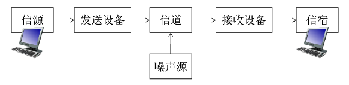
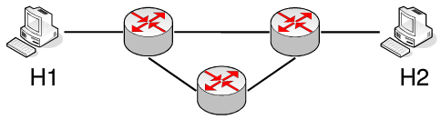
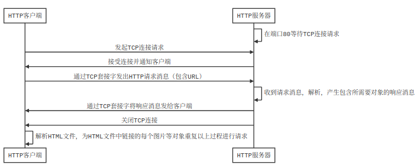

# 计算机网络

通信系统模型：



## 第0周 计算机网络概述

计算机网络定义：**互连**的、**自治**的计算机集合。

计算机网络是**通信技术**与**计算机技术**紧密结合的产物。

Internet中**端系统**又叫做**主机**，采用的通信链路有**光纤**、**铜缆**、**无线电**、**卫星**，使用**分组交换**方式，**交换网络**中主要有**路由器**和**交换机**。

网络协议三要素：**语法**、**语义**、**时序（同步）**。

计算机网络结构：**网络边缘**、**接入网络**、**网络核心**。

### 网络核心

关键功能：**路由**、**转发**。

解决的基本问题：**数据交换**。

#### 数据交换的类型

- **电路交换**

  阶段：**建立连接**、**通信**、**释放连接**。

  独占/共享：**独占资源**。

  如何共享中继线：**多路复用**。

  多路复用的方法：**频分多路复用**、**时分多路复用**、**波分多路复用**、**码分多路复用**。

- **报文交换**

  一次发送一个信息整体。

  交换方式：**存储-转发**。

- **分组交换**

  需要报文的**拆分**与**重组**， 有**额外开销**。

  交换方式：**存储-转发**。

  如何共享中继线：**统计多路复用**。

分组交换适用于**突发数据传输网络**，允许更多用户同时使用网络，但可能产生拥塞（分组延迟和丢失）。

### 性能

- 速率（数据率、比特率）：单位时间传输信息量（bit）。往往指**额定速率**或**标称速率**。

- 带宽：**最高数据率**。

- 延迟（时延）

  丢包和时延原因：

  - 分组**到达速率超出输出链路容量**。
  - 分组排队，**等待输出链路可用**。

  分组延迟分类：**节点处理延迟**、**排队延迟**、**传输延迟**、**传播延迟**。

- 流量强度=分组长度×分组平均到达速率/链路带宽

  流量强度→0：**平均**排队延迟**很小**。

  流量强度→1：**平均**排队延迟**很大**。

  流量强度>1：超出服务能力，**平均**排队延迟**无限大**。

- 时延带宽积=传播时延×带宽

  又称**以比特为单位的链路长度**，可理解为同一时间内链路中可容纳（正在传播）的比特数。

- 分组丢失（丢包）

  原因：队列缓存容量有限，分组**到达已满队列**将被丢弃。

  丢包率=丢包数/已发分组总数

- 吞吐量（吞吐率）：**发送端与接收端之间**传送数据的速率。

  瓶颈链路：端到端路径上，**限制端到端吞吐量**的链路。

### 体系结构

计算机网络体系结构是从**功能上**描述计算机网络结构，是**分层结构**，每层遵循某个/些**网络协议**完成本层功能。下层协议的实现对上层的服务用户是**透明**的，同系统的相邻层实体间通过**接口**进行交互。

#### OSI参考模型（7层）（仅用于理论）


目的：支持**异构网络系统**的互联互通。

数据封装时添加的**控制信息**包括：

- **地址**：标识发送端/接收端。
- **差错检测编码**：用于查错及纠正。
- **协议控制**：协议附加信息。

各层功能：

- 物理层：适应接口特性（机械特性、电气特性、功能特性、规程特性），负责比特同步。

  **传输模式**有：

  - **单工**：仅某一方能向另一方发送信息，另一方仅能接受信息。
  - **半双工**：双方可互相发送和接收信息，但发送与接收不能同时进行。
  - **全双工**：双方可互相同时发送和接收信息。

- 数据链路层：负责**节点到节点数据传输**、**组帧**、**物理寻址**、**流量控制**、**差错控制**、**访问（接入）控制**。

- 网络层：负责**源主机到目的主机**数据分组交付、**逻辑寻址**、**路由**、**分组转发**。

- 传输层：负责端到端**进程**间的**完整报文**传输，职责包括**分段与重组**、**SAP寻址**（如端口号）、**连接控制**、**（端到端）流量控制**、**（端到端）差错控制**。

- 会话层：负责**对话控制**、**同步**（在数据流中插入同步点）。

- 表示层：处理两系统间信息的语法与语义问题，包括**数据表示转化**（编码转换）、**加密/解密**、**压缩/解压缩**。

- 应用层：支持用户通过**用户代理**（如浏览器）或**网络接口**使用网络（服务）。

  典型服务：**文件传输（FTP）**、**电子邮件（SMTP）**、**Web（HTTP）**。

#### TCP/IP参考模型（5层）（多用于实践）

各层典型协议：

- 应用层：**FTP**、**SMTP**、**HTTP**。
- 传输层：**TCP**、**UDP**。
- 网络层：**IP协议**、**路由协议**。
- 链路层：**以太网**、**802.11**（WiFi）、**PPP**。
- 物理层：无。

**主机**通常为**应用层设备**；**路由器**通常为**网络层设备**；**交换机**通常为**数据链路层设备**。

### 例题

#### 题目

> 在如图所示的采用“存储-转发”方式的分组交换网络中，所有链路的数据传输速率为100Mbps，分组大小为1000B， 其中分组头大小为20B。若主机H1向主机H2发送一个大小为980000B的文件，则在不考虑分组拆装时间和传播延迟的情况下，从H1发送开始到H2接收完位置，需要的时间至少是多少？
>
> 

#### 题解

980 000 B的文件需要分1000个分组，每分组1000B。

H1发送整个文件的传输延迟为(980000+20×1000)×8/100000000=80ms

最后一个分组的两次转发传输延迟为2×1000×8/100000000=0.16ms

总用时为80+0.16=80.16ms。

## 第1周 网络应用

### 体系结构

- **客户机/服务器**（C/S）结构

  服务器特点：

  - 7*24小时提供服务（**持久接入网络**）
  - **永久性**的可访问地址/域名
  - 利用**大量服务器**实现**可扩展性**

  客户机特点：

  - **间歇性**接入网络
  - 可能使用**动态IP**地址
  - **不会与其它客户机直接通信**

  典型例子：Web。

- **点对点**（P2P）结构

  特点：

  - **没有永远在线**的服务器
  - 任意端系统/节点之间可**直接**通讯
  - 节点**间歇性**接入网络
  - 节点可能使用**动态IP**地址

  优点：高度**可伸缩**。

  缺点：**难于管理**。

- **混合**（Hybrid）结构

  典型例子：Napster

  - 文件传输使用P2P结构。
  - 查询使用C/S结构。

### 网络应用进程通信

不同主机上运行的进程间使用**消息交换（报文交换）**进行通信。发起通信的进程称为**客户机进程**，等待通信请求的进程称为**服务器进程**。**这两个概念在P2P结构中也存在。**

**套接字**（Socket）：**操作系统**提供的用于**网络通信**的API。

进程寻址：为了唯一确定另一主机上的一个进程，需要该**主机的IP地址**+该**进程分配到的端口号**作为该进程的标识符。

#### 应用层协议

公开协议：由**RFC**（Request For Comments）定义，允许**互操作**。

私有协议：自行设计的，不公开的协议。

##### 内容

- **消息的类型**
- **消息的语法**（格式）：消息中有哪些字段，每个字段如何描述。
- **字段的语义**：字段中信息的含义
- **规则**：进程发送消息的规则，例如何时发送/怎样发送等。

### 传输服务

#### 网络应用对传输的需求

- **数据丢失/可靠性**：某些网络应用能够容忍一定程度的数据丢失（如网络电话），另一些要求100%可靠的数据传输（如文件传输）。
- **时间/延迟**：某些网络应用仅在延迟足够低时才有效（如网络游戏）。
- **带宽**：某些应用只有在带宽达到最低要求时才有效，另一些则能适应任何带宽（如email）。

#### Internet提供的传输服务

- **TCP服务**

  - 面向**连接**：客户机/服务器进程间需要建立连接。 

  - **可靠**传输：保证数据正确，不丢包。
  - 流量控制
  - 拥塞控制
  - **不提供时间/延迟保障**
  - **不提供最小带宽保障**

- **UDP服务**

  - **无连接**
  - **不可靠**的数据传输
  - 不提供流量控制、拥塞控制、延迟保障、带宽保障。

### Web应用

万维网（World Wide Web）的主体是**互相链接的网页**。网页包含多个**对象**（HTML文件、JPEG图片等），基本HTML文件包含对其他**对象**引用的**链接**。

**统一资源定位器**（URL）：用于**对象的寻址**。格式为`scheme://host:port/path`，其中`scheme`为协议，`host`为主机地址（域名或IP地址），`port`为端口号，`path`为资源在主机上的路径。

#### 超文本传输协议（HTTP）

- 结构：**C/S结构**。

- 传输服务：**TCP服务**。
- 端口：**80**
- 特点：HTTP是无状态协议，即服务器不维护任何有关客户端过去所发请求的信息。

##### 连接类型

- HTTP 1.0版本使用**非持久性连接**，即每个TCP连接最多允许传输**一个**对象。

  示例：

  

- HTTP 1.1版本默认使用**持久性连接**，即每个TCP连接允许传输**多个**对象。

##### 响应时间分析

RTT(Round Trip Time)：从客户端发送一个很小的数据包到服务器并返回所经历的时间。

- 非持久性连接：

  1. 发起、建立TCP连接：1个RTT
  2. 发送HTTP请求消息到HTTP响应消息到达：1个RTT
  3. 响应消息中的对象传输时间

  每对象总时间=2×RTT+文件发送时间

- 持久性连接：

  - 无流水机制时，客户端只有**收到前一个响应后**才发送新请求，每个被引用对象耗时1个RTT。

    每对象总时间=RTT+文件发送时间

  - 有流水机制时（HTTP1.1默认），客户端只要遇到引用对象就尽快发送请求，理想情况下所有对象共耗时1个RTT。

    每对象总时间=RTT/对象个数+文件发送时间

##### 消息格式

- **请求消息**

  - 使用**ASCII码**书写

  - 方法：

    - **GET**(HTTP 1.0/1.1)：用于请求对象。
    - **POST**(HTTP 1.0/1.1)：在数据体中上传客户端的输入，如需填写的表格。
    - **URL**：实际使用**GET**方法，输入信息通过URL上传。
    - **HEAD**(HTTP 1.0/1.1)：请Server不要将所请求的对象放入响应消息中。
    - **PUT**(HTTP 1.1)：将消息体中文件上传到URL字段指定的路径。
    - **DELETE**(HTTP 1.1)：删除URL字段指定的文件。

  - 通用格式：（第1行称为“请求行”，第2-5行可扩展，称为“头部行”）

    ```
    方法 URL 版本
    头字段名: 值
    头字段名: 值
    ……
    头字段名: 值
    
    数据体
    ```

  - 示例：

    ```http
    GET /somedir/page.html HTTP/1.1
    Host: www.someschool.edu
    User-agent: Mozilla/4.0
    Connection: close
    Accept-language: fr
    (empty line)
    (extra carriage)
    ```

- **响应消息**

  - 常见响应状态代码

    | 代码 | 描述                       |
    | ---- | -------------------------- |
    | 200  | OK                         |
    | 301  | Moved Permanently          |
    | 400  | Bad Request                |
    | 404  | Not Found                  |
    | 505  | HTTP Version Not Supported |

  - 通用格式：（第1行称为“状态行”，第2-5行可扩展，称为“头部行”）

    ```
    版本 状态码 状态描述
    头字段名: 值
    头字段名: 值
    ……
    头字段名: 值
    
    数据体
    ```

  - 示例：

    ```http
    HTTP/1.1 200 OK
    Connection: close
    Date: Thu, 06 Aug 1998 12:00:15 GMT
    Server: Apache/1.3.0 (Unix)
    Last-Modified: Mon, 22 Jun 1998 ......
    Content-Length: 6821
    Contnt-Type: text/html
    (empty line)
    (data)
    ```

#### Cookie

定义：某些网站为了**辨别用户身份**、**进行会话跟踪**而储存在用户**本地终端**上的数据（通常**经过加密**）。

组件：

- HTTP响应消息的cookie头部行
- HTTP请求消息的cookie头部行
- 保存在客户端主机上的cookie文件，由浏览器管理
- Web服务器端的后台数据库

作用：身份认证、购物车、推荐、Web email等

#### Web缓存/代理服务器

功能：在**不访问服务器**的前提下满足客户端的HTTP请求。

作用：

- 缩短客户请求的响应时间
- 减少机构/组织的流量
- 实现大范围内有效的内容分发

##### 缓存内容与远端不一致问题

**条件性GET**方法：代理服务器在HTTP请求中声明**持有版本的修改日期**，若在修改日期后有新版本，则服务器返回**200 OK**及**新版本对象**，否则返回**304 Not Modified**。

### Email应用

#### 组件

- **邮件客户端**：读写Email消息，与服务器交互收发Email消息。
- **邮件服务器**：维护**邮箱**（存储发送给该用户的Email）和**消息队列**（存储等待发送的Email）。
- **SMTP**（Simple Mail Transfer Protocol）：用于邮件服务器之间传递消息。客户端为发送消息的服务器；服务器为接收消息的服务器。

#### SMTP协议（邮件发送协议）

- 传输服务：**TCP**

- 端口：**25**

- 阶段：**握手**；**消息传输**；**关闭**。

- 消息格式

  Email消息仅能包含**7位ASCII码**。使用`CRLF.CRLF`确定消息结束。

  - **命令**消息：ASCII文本
  - **响应**消息：状态代码和语句

- 交互示例：

  ```
  Server: 220 hamburger.edu
  Client: HELO crepes.fr
  Server: 250  Hello crepes.fr, pleased to meet you
  (Connection opened)
  Client: MAIL FROM: <alice@crepes.fr>
  Server: 250 alice@crepes.fr ... Sender ok
  Client: RCPT TO: <bob@hamburger.edu>
  Server: 250 bob@hamburger.edu ... Recipient ok
  Client: DATA
  Server: 354 Enter mail, end with "." on a line by itself
  Client: Do you like ketchup?
  Client: How about pickles?
  Client: .
  Server: 250 Message accepted for delivery
  Client: QUIT
  Server: 221 hamburger.edu closing connection
  (Connection closed)
  ```

- Email消息格式：

  - 头部行（header）：To，From，Subject。
  - 消息体（body）：消息本身，只能是ASCII字符。

- **多媒体邮件扩展**（**MIME**）

  通过在邮件头部增加额外行以声明MIME内容类型。

  格式：

  ```
  From: 发件人
  To: 收件人
  Subject: 主题
  MIME-Version: MIME版本号
  Content-Transfer-Encoding: 数据编码方法（如base64）
  Content-Type: 多媒体数据类型，子类型及参数声明（如image/jpeg）
  
  编码后的数据
  ```

#### 邮件访问协议

**POP**、**IMAP**、**HTTP**都可作为邮件访问协议。

##### POP3协议

- 有无状态：**无状态**

- 命令

  - 认证阶段：
    - 客户端命令：User声明用户名、Pass声明密码
    - 服务器响应：+OK表示合法用户、-ERR表示非法用户或密码错误。
  - 事务阶段：
    - List列出消息数量
    - Retr用编号获取消息
    - Dele删除消息
    - Quit退出

- 模式

  - 下载并删除：用户如果切换客户端将**无法重读邮件**。
  - 下载并保持：不同客户端都可以**保留消息拷贝**。

- 示例：

  ```
  (认证阶段)
  Server: +OK POP3 server ready
  Client: user bob
  Server: +OK
  Client: pass hungry
  Server: +OK user successfully logged on
  (事务阶段)
  Client: list
  Server: 1 498
  Server: 2 912
  Server: .
  Client: retr 1
  Server: <message 1 contents>
  Server: .
  Client: dele 1
  Client: retr 2
  Server: <message 1 contents>
  Server: .
  Client: dele 2
  Client: quit
  Server: +OK POP3 server signing off
  ```

##### IMAP协议

- 所有消息统一保存在**服务器**。
- 允许利用**文件夹**组织消息。
- 有无状态：支持**跨会话**的用户状态，包括文件夹的名字、文件夹与消息ID间的映射等。

### DNS应用

定义：由**多层命名服务器**构成的**分布式数据库**，是**应用层**协议。

目的：解决**Internet**上**主机/路由器**的识别问题，即**解析域名**，**映射至IP地址**。

集中式DNS的问题：**单点失败**问题、**流量**问题、**距离**问题、**维护性**问题。总之，是**不可伸缩**问题。

DNS服务：域名向IP地址的翻译、主机/邮件服务器别名、负载均衡（Web服务器）。

#### DNS服务器层次

1. **根域名服务器**

   **本地域名服务器**无法解析域名时，访问**根域名服务器**。全球有13个根域名服务器（**中国没有**）。

   工作流程：

   1. 若不知道映射，则访问顶级域名服务器**获得映射**。
   2. 向本地域名服务器**返回映射**。

2. **顶级域名服务器**（TLD）

   负责`com`，`org`，`net`，`edu`等顶级域名和`cn`，`uk`，`fr`等国家顶级域名。

   Network Solutions（公司）维护`com`顶级域名服务器

   Educause维护`edu`顶级域名服务器。

3. **权威域名服务器**

   提供组织内部服务器的解析服务。由组织或服务提供商维护。

4. **本地域名服务器**（不严格属于层次体系）

   每个**ISP**有一个本地域名服务器，也称默认域名解析服务器。

   主机进行DNS查询时，查询被发送至本地域名服务器。其作为**代理**将查询转发给**层级中的域名服务器**。

#### DNS查询方式

- **迭代查询**：被查询服务器**返回域名解析服务器名字**，以作为新的被查询服务器。
- **递归查询**：被查询服务器必须**查询到解析结果**，之后**返回结果**。

#### 查询示例

查询`www.amazon.com`的IP地址：

1. 查询根服务器，找到`com`域名解析服务器。
2. 查询`com`域名解析服务器，找到`amazon.com`域名解析服务器。
3. 查询`amazon.com`域名解析服务器，获得`www.amazon.com`的IP地址。

#### DNS缓存

- 域名解析服务器每获得一**域名-IP映射**，即**缓存**之。一段时间过后，缓存条目失效。
- **本地域名服务器**一般会缓存**顶级域名服务器**的映射。（因此根域名服务器**不常被访问**）

#### DNS记录格式

DNS记录称为**资源记录**。格式为`(name, value, type, ttl)`。`type`取值不同将影响`name`和`value`的语义。

##### 类型（type取值）

- A（主机域名解析服务）
  - Name：主机域名
  - Value：IP地址
- NS（域解析服务）
  - Name：域（如`edu.cn`）
  - Value：该域**权威域名服务器**的主机**域名**。

- CNAME（别名服务）
  - Name：某真实域名的**别名**
  - Value：真实域名
- MX（邮件服务）
  - Name：域名
  - Value：与Name对应的邮件服务器

#### DNS协议消息格式

**查询消息**与**回复消息**格式**相同**。

- 消息头部
  - Identification：16位**查询编号**，回复时使用**相同编号**。
  - flags：**标志位**，例如标志查询或回复、是否期望递归、递归是否可用、是否权威回答等。
  - 问题数目、回答数目等
- 消息体
  - 问题内容、回答内容等

#### 怎样注册域名

假设公司名为"Network Utopia"。

1. 在域名管理机构注册域名`networkutopia.com`。

   域名管理机构向`com`顶级域名服务器中插入记录

   ```
   (networkutopia.com, dns1.networkutopia.com, NS)
   (dns1.networkutopia.com, 212.212.212.1, A)
   ```

2. 在权威域名解析服务器`dns1.networkutopia.com`中为`www.networkutopia.com`加入Type A记录。

   为`networkutopia.com`加入Type MX记录。

### 例题

#### 题目

> 如果本地域名服务器无缓存，当采用递归方法解析另一网络某主机域名时，用户主机、本地域名服务器发送的域名请求消息数分别为
>
> A. 一条、一条
>
> B. 一条、多条
>
> C. 多条、一条
>
> D. 多条、多条

#### 题解

由于采用递归方法，

本地域名服务器**代理**后续查询，因此主机仅发送1条。

本地域名服务器无缓存，因此向另一域名服务器发送查询请求，被查询服务器**代理**后续查询，因此本地域名服务器仅发送1条。

故选A.