# 计算机网络

通信系统模型：


## 第0周 计算机网络概述

计算机网络定义：**互连**的、**自治**的计算机集合。

计算机网络是**通信技术**与**计算机技术**紧密结合的产物。

Internet中**端系统**又叫做**主机**，采用的通信链路有**光纤**、**铜缆**、**无线电**、**卫星**，使用**分组交换**方式，**交换网络**中主要有**路由器**和**交换机**。

网络协议三要素：**语法**、**语义**、**时序（同步）**。

计算机网络结构：**网络边缘**、**接入网络**、**网络核心**。

### 网络核心

关键功能：**路由**、**转发**。

解决的基本问题：**数据交换**。

#### 数据交换的类型

- **电路交换**

  阶段：**建立连接**、**通信**、**释放连接**。

  独占/共享：**独占资源**。

  如何共享中继线：**多路复用**。

  多路复用的方法：**频分多路复用**、**时分多路复用**、**波分多路复用**、**码分多路复用**。

- **报文交换**

  一次发送一个信息整体。

  交换方式：**存储-转发**。

- **分组交换**

  需要报文的**拆分**与**重组**， 有**额外开销**。

  交换方式：**存储-转发**。

  如何共享中继线：**统计多路复用**。

分组交换适用于**突发数据传输网络**，允许更多用户同时使用网络，但可能产生拥塞（分组延迟和丢失）。

### 性能

- 速率（数据率、比特率）：单位时间传输信息量（bit）。往往指**额定速率**或**标称速率**。

- 带宽：**最高数据率**。

- 延迟（时延）

  丢包和时延原因：

  - 分组**到达速率超出输出链路容量**。
  - 分组排队，**等待输出链路可用**。

  分组延迟分类：**节点处理延迟**、**排队延迟**、**传输延迟**、**传播延迟**。

- 流量强度=分组长度×分组平均到达速率/链路带宽

  流量强度→0：**平均**排队延迟**很小**。

  流量强度→1：**平均**排队延迟**很大**。

  流量强度>1：超出服务能力，**平均**排队延迟**无限大**。

- 时延带宽积=传播时延×带宽

  又称**以比特为单位的链路长度**，可理解为同一时间内链路中可容纳（正在传播）的比特数。

- 分组丢失（丢包）

  原因：队列缓存容量有限，分组**到达已满队列**将被丢弃。

  丢包率=丢包数/已发分组总数

- 吞吐量（吞吐率）：**发送端与接收端之间**传送数据的速率。

  瓶颈链路：端到端路径上，**限制端到端吞吐量**的链路。

### 体系结构

计算机网络体系结构是从**功能上**描述计算机网络结构，是**分层结构**，每层遵循某个/些**网络协议**完成本层功能。下层协议的实现对上层的服务用户是**透明**的，同系统的相邻层实体间通过**接口**进行交互。

#### OSI参考模型（7层）（仅用于理论）


目的：支持**异构网络系统**的互联互通。

数据封装时添加的**控制信息**包括：

- **地址**：标识发送端/接收端。
- **差错检测编码**：用于查错及纠正。
- **协议控制**：协议附加信息。

各层功能：

- 物理层：适应接口特性（机械特性、电气特性、功能特性、规程特性），负责比特同步。

  **传输模式**有：

  - **单工**：仅某一方能向另一方发送信息，另一方仅能接受信息。
  - **半双工**：双方可互相发送和接收信息，但发送与接收不能同时进行。
  - **全双工**：双方可互相同时发送和接收信息。

- 数据链路层：负责**节点到节点数据传输**、**组帧**、**物理寻址**、**流量控制**、**差错控制**、**访问（接入）控制**。

- 网络层：负责**源主机到目的主机**数据分组交付、**逻辑寻址**、**路由**、**分组转发**。

- 传输层：负责端到端**进程**间的**完整报文**传输，职责包括**分段与重组**、**SAP寻址**（如端口号）、**连接控制**、**（端到端）流量控制**、**（端到端）差错控制**。

- 会话层：负责**对话控制**、**同步**（在数据流中插入同步点）。

- 表示层：处理两系统间信息的语法与语义问题，包括**数据表示转化**（编码转换）、**加密/解密**、**压缩/解压缩**。

- 应用层：支持用户通过**用户代理**（如浏览器）或**网络接口**使用网络（服务）。

  典型服务：**文件传输（FTP）**、**电子邮件（SMTP）**、**Web（HTTP）**。

#### TCP/IP参考模型（5层）（多用于实践）

各层典型协议：

- 应用层：**FTP**、**SMTP**、**HTTP**。
- 传输层：**TCP**、**UDP**。
- 网络层：**IP协议**、**路由协议**。
- 链路层：**以太网**、**802.11**（WiFi）、**PPP**。
- 物理层：无。

**主机**通常为**应用层设备**；**路由器**通常为**网络层设备**；**交换机**通常为**数据链路层设备**。

### 例题

#### 题目

> 在如图所示的采用“存储-转发”方式的分组交换网络中，所有链路的数据传输速率为100Mbps，分组大小为1000B， 其中分组头大小为20B。若主机H1向主机H2发送一个大小为980000B的文件，则在不考虑分组拆装时间和传播延迟的情况下，从H1发送开始到H2接收完位置，需要的时间至少是多少？
>
> 

#### 题解

980 000 B的文件需要分1000个分组，每分组1000B。

H1发送整个文件的传输延迟为(980000+20×1000)×8/100000000=80ms

最后一个分组的两次转发传输延迟为2×1000×8/100000000=0.16ms

总用时为80+0.16=80.16ms。

## 第1-2周 应用层

### 体系结构

- **客户机/服务器**（C/S）结构

  服务器特点：

  - 7*24小时提供服务（**持久接入网络**）
  - **永久性**的可访问地址/域名
  - 利用**大量服务器**实现**可扩展性**

  客户机特点：

  - **间歇性**接入网络
  - 可能使用**动态IP**地址
  - **不会与其它客户机直接通信**

  典型例子：Web。

- **点对点**（P2P）结构

  特点：

  - **没有永远在线**的服务器
  - 任意端系统/节点之间可**直接**通讯
  - 节点**间歇性**接入网络
  - 节点可能使用**动态IP**地址

  优点：高度**可伸缩**。

  缺点：**难于管理**。

- **混合**（Hybrid）结构

  典型例子：Napster

  - 文件传输使用P2P结构。
  - 查询使用C/S结构。

### 网络应用进程通信

不同主机上运行的进程间使用**消息交换（报文交换）**进行通信。发起通信的进程称为**客户机进程**，等待通信请求的进程称为**服务器进程**。**这两个概念在P2P结构中也存在。**

**套接字**（Socket）：**操作系统**提供的用于**网络通信**的API。

进程寻址：为了唯一确定另一主机上的一个进程，需要该**主机的IP地址**+该**进程分配到的端口号**作为该进程的标识符。

#### 应用层协议

公开协议：由**RFC**（Request For Comments）定义，允许**互操作**。

私有协议：自行设计的，不公开的协议。

##### 内容

- **消息的类型**
- **消息的语法**（格式）：消息中有哪些字段，每个字段如何描述。
- **字段的语义**：字段中信息的含义
- **规则**：进程发送消息的规则，例如何时发送/怎样发送等。

### 传输服务

#### 网络应用对传输的需求

- **数据丢失/可靠性**：某些网络应用能够容忍一定程度的数据丢失（如网络电话），另一些要求100%可靠的数据传输（如文件传输）。
- **时间/延迟**：某些网络应用仅在延迟足够低时才有效（如网络游戏）。
- **带宽**：某些应用只有在带宽达到最低要求时才有效，另一些则能适应任何带宽（如email）。

#### Internet提供的传输服务

- **TCP服务**

  - 面向**连接**：客户机/服务器进程间需要建立连接。 

  - **可靠**传输：保证数据正确，不丢包。
  - 流量控制
  - 拥塞控制
  - **不提供时间/延迟保障**
  - **不提供最小带宽保障**

- **UDP服务**

  - **无连接**
  - **不可靠**的数据传输
  - 不提供流量控制、拥塞控制、延迟保障、带宽保障。

### Web应用

万维网（World Wide Web）的主体是**互相链接的网页**。网页包含多个**对象**（HTML文件、JPEG图片等），基本HTML文件包含对其他**对象**引用的**链接**。

**统一资源定位器**（URL）：用于**对象的寻址**。格式为`scheme://host:port/path`，其中`scheme`为协议，`host`为主机地址（域名或IP地址），`port`为端口号，`path`为资源在主机上的路径。

#### 超文本传输协议（HTTP）

- 结构：**C/S结构**。

- 传输服务：**TCP服务**。
- 端口：**80**
- 特点：HTTP是无状态协议，即服务器不维护任何有关客户端过去所发请求的信息。

##### 连接类型

- HTTP 1.0版本使用**非持久性连接**，即每个TCP连接最多允许传输**一个**对象。

  示例：

  

- HTTP 1.1版本默认使用**持久性连接**，即每个TCP连接允许传输**多个**对象。

##### 响应时间分析

RTT(Round Trip Time)：从客户端发送一个很小的数据包到服务器并返回所经历的时间。

- 非持久性连接：

  1. 发起、建立TCP连接：1个RTT
  2. 发送HTTP请求消息到HTTP响应消息到达：1个RTT
  3. 响应消息中的对象传输时间

  每对象总时间=2×RTT+文件发送时间

- 持久性连接：

  - 无流水机制时，客户端只有**收到前一个响应后**才发送新请求，每个被引用对象耗时1个RTT。

    每对象总时间=RTT+文件发送时间

  - 有流水机制时（HTTP1.1默认），客户端只要遇到引用对象就尽快发送请求，理想情况下所有对象共耗时1个RTT。

    每对象总时间=RTT/对象个数+文件发送时间

##### 消息格式

- **请求消息**

  - 使用**ASCII码**书写

  - 方法：

    - **GET**(HTTP 1.0/1.1)：用于请求对象。
    - **POST**(HTTP 1.0/1.1)：在数据体中上传客户端的输入，如需填写的表格。
    - **URL**：实际使用**GET**方法，输入信息通过URL上传。
    - **HEAD**(HTTP 1.0/1.1)：请Server不要将所请求的对象放入响应消息中。
    - **PUT**(HTTP 1.1)：将消息体中文件上传到URL字段指定的路径。
    - **DELETE**(HTTP 1.1)：删除URL字段指定的文件。

  - 通用格式：（第1行称为“请求行”，第2-5行可扩展，称为“头部行”）

    ```
    方法 URL 版本
    头字段名: 值
    头字段名: 值
    ……
    头字段名: 值
    
    数据体
    ```

  - 示例：

    ```http
    GET /somedir/page.html HTTP/1.1
    Host: www.someschool.edu
    User-agent: Mozilla/4.0
    Connection: close
    Accept-language: fr
    (empty line)
    (extra carriage)
    ```

- **响应消息**

  - 常见响应状态代码

    | 代码 | 描述                       |
    | ---- | -------------------------- |
    | 200  | OK                         |
    | 301  | Moved Permanently          |
    | 400  | Bad Request                |
    | 404  | Not Found                  |
    | 505  | HTTP Version Not Supported |

  - 通用格式：（第1行称为“状态行”，第2-5行可扩展，称为“头部行”）

    ```
    版本 状态码 状态描述
    头字段名: 值
    头字段名: 值
    ……
    头字段名: 值
    
    数据体
    ```

  - 示例：

    ```http
    HTTP/1.1 200 OK
    Connection: close
    Date: Thu, 06 Aug 1998 12:00:15 GMT
    Server: Apache/1.3.0 (Unix)
    Last-Modified: Mon, 22 Jun 1998 ......
    Content-Length: 6821
    Content-Type: text/html
    (empty line)
    (data)
    ```

#### Cookie

定义：某些网站为了**辨别用户身份**、**进行会话跟踪**而储存在用户**本地终端**上的数据（通常**经过加密**）。

组件：

- HTTP响应消息的cookie头部行
- HTTP请求消息的cookie头部行
- 保存在客户端主机上的cookie文件，由浏览器管理
- Web服务器端的后台数据库

作用：身份认证、购物车、推荐、Web email等

#### Web缓存/代理服务器

功能：在**不访问服务器**的前提下满足客户端的HTTP请求。

作用：

- 缩短客户请求的响应时间
- 减少机构/组织的流量
- 实现大范围内有效的内容分发

##### 缓存内容与远端不一致问题

**条件性GET**方法：代理服务器在HTTP请求中声明**持有版本的修改日期**，若在修改日期后有新版本，则服务器返回**200 OK**及**新版本对象**，否则返回**304 Not Modified**。

### Email应用

#### 组件

- **邮件客户端**：读写Email消息，与服务器交互收发Email消息。
- **邮件服务器**：维护**邮箱**（存储发送给该用户的Email）和**消息队列**（存储等待发送的Email）。
- **SMTP**（Simple Mail Transfer Protocol）：用于邮件服务器之间传递消息。客户端为发送消息的服务器；服务器为接收消息的服务器。

#### SMTP协议（邮件发送协议）

- 传输服务：**TCP**

- 端口：**25**

- 阶段：**握手**；**消息传输**；**关闭**。

- 消息格式

  Email消息仅能包含**7位ASCII码**。使用`CRLF.CRLF`确定消息结束。

  - **命令**消息：ASCII文本
  - **响应**消息：状态代码和语句

- 交互示例：

  ```
  Server: 220 hamburger.edu
  Client: HELO crepes.fr
  Server: 250  Hello crepes.fr, pleased to meet you
  (Connection opened)
  Client: MAIL FROM: <alice@crepes.fr>
  Server: 250 alice@crepes.fr ... Sender ok
  Client: RCPT TO: <bob@hamburger.edu>
  Server: 250 bob@hamburger.edu ... Recipient ok
  Client: DATA
  Server: 354 Enter mail, end with "." on a line by itself
  Client: Do you like ketchup?
  Client: How about pickles?
  Client: .
  Server: 250 Message accepted for delivery
  Client: QUIT
  Server: 221 hamburger.edu closing connection
  (Connection closed)
  ```

- Email消息格式：

  - 头部行（header）：To，From，Subject。
  - 消息体（body）：消息本身，只能是ASCII字符。

- **多媒体邮件扩展**（**MIME**）

  通过在邮件头部增加额外行以声明MIME内容类型。

  格式：

  ```
  From: 发件人
  To: 收件人
  Subject: 主题
  MIME-Version: MIME版本号
  Content-Transfer-Encoding: 数据编码方法（如base64）
  Content-Type: 多媒体数据类型，子类型及参数声明（如image/jpeg）
  
  编码后的数据
  ```

#### 邮件访问协议

**POP**、**IMAP**、**HTTP**都可作为邮件访问协议。

##### POP3协议

- 有无状态：**无状态**

- 命令

  - 认证阶段：
    - 客户端命令：User声明用户名、Pass声明密码
    - 服务器响应：+OK表示合法用户、-ERR表示非法用户或密码错误。
  - 事务阶段：
    - List列出消息数量
    - Retr用编号获取消息
    - Dele删除消息
    - Quit退出

- 模式

  - 下载并删除：用户如果切换客户端将**无法重读邮件**。
  - 下载并保持：不同客户端都可以**保留消息拷贝**。

- 示例：

  ```
  (认证阶段)
  Server: +OK POP3 server ready
  Client: user bob
  Server: +OK
  Client: pass hungry
  Server: +OK user successfully logged on
  (事务阶段)
  Client: list
  Server: 1 498
  Server: 2 912
  Server: .
  Client: retr 1
  Server: <message 1 contents>
  Server: .
  Client: dele 1
  Client: retr 2
  Server: <message 1 contents>
  Server: .
  Client: dele 2
  Client: quit
  Server: +OK POP3 server signing off
  ```

##### IMAP协议

- 所有消息统一保存在**服务器**。
- 允许利用**文件夹**组织消息。
- 有无状态：支持**跨会话**的用户状态，包括文件夹的名字、文件夹与消息ID间的映射等。

### DNS应用

定义：由**多层命名服务器**构成的**分布式数据库**，是**应用层**协议。

目的：解决**Internet**上**主机/路由器**的识别问题，即**解析域名**，**映射至IP地址**。

集中式DNS的问题：**单点失败**问题、**流量**问题、**距离**问题、**维护性**问题。总之，是**不可伸缩**问题。

DNS服务：域名向IP地址的翻译、主机/邮件服务器别名、负载均衡（Web服务器）。

#### DNS服务器层次

1. **根域名服务器**

   **本地域名服务器**无法解析域名时，访问**根域名服务器**。全球有13个根域名服务器（**中国没有**）。

   工作流程：

   1. 若不知道映射，则访问顶级域名服务器**获得映射**。
   2. 向本地域名服务器**返回映射**。

2. **顶级域名服务器**（TLD）

   负责`com`，`org`，`net`，`edu`等顶级域名和`cn`，`uk`，`fr`等国家顶级域名。

   Network Solutions（公司）维护`com`顶级域名服务器

   Educause维护`edu`顶级域名服务器。

3. **权威域名服务器**

   提供组织内部服务器的解析服务。由组织或服务提供商维护。

4. **本地域名服务器**（不严格属于层次体系）

   每个**ISP**有一个本地域名服务器，也称默认域名解析服务器。

   主机进行DNS查询时，查询被发送至本地域名服务器。其作为**代理**将查询转发给**层级中的域名服务器**。

#### DNS查询方式

- **迭代查询**：被查询服务器**返回域名解析服务器名字**，以作为新的被查询服务器。
- **递归查询**：被查询服务器必须**查询到解析结果**，之后**返回结果**。

#### 查询示例

查询`www.amazon.com`的IP地址：

1. 查询根服务器，找到`com`域名解析服务器。
2. 查询`com`域名解析服务器，找到`amazon.com`域名解析服务器。
3. 查询`amazon.com`域名解析服务器，获得`www.amazon.com`的IP地址。

#### DNS缓存

- 域名解析服务器每获得一**域名-IP映射**，即**缓存**之。一段时间过后，缓存条目失效。
- **本地域名服务器**一般会缓存**顶级域名服务器**的映射。（因此根域名服务器**不常被访问**）

#### DNS记录格式

DNS记录称为**资源记录**。格式为`(name, value, type, ttl)`。`type`取值不同将影响`name`和`value`的语义。

##### 类型（type取值）

- A（主机域名解析服务）
  - Name：主机域名
  - Value：IP地址
- NS（域名服务器解析服务）
  - Name：域名（如`hit.edu.cn`）
  - Value：该域**权威域名服务器**的主机**域名**。

- CNAME（别名服务）
  - Name：某真实域名的**别名**
  - Value：真实域名
- MX（邮件服务器别名服务）
  - Name：邮件服务器的别名
  - Value：邮件服务器的真实域名

#### DNS协议消息格式

**查询消息**与**回复消息**格式**相同**。

- 消息头部
  - Identification：16位**查询编号**，回复时使用**相同编号**。
  - flags：**标志位**，例如标志查询或回复、是否期望递归、递归是否可用、是否权威回答等。
  - 问题数目、回答数目等
- 消息体
  - 问题内容、回答内容等

#### 怎样注册域名

假设公司名为"Network Utopia"。

1. 在域名管理机构注册域名`networkutopia.com`。

   域名管理机构向`com`顶级域名服务器中插入记录

   ```
   (networkutopia.com, dns1.networkutopia.com, NS)
   (dns1.networkutopia.com, 212.212.212.1, A)
   ```

2. 在权威域名解析服务器`dns1.networkutopia.com`中为`www.networkutopia.com`加入Type A记录。

   为`networkutopia.com`加入Type MX记录。

### P2P应用

#### P2P架构

- **无服务器**
- 端系统间**直接通信**
- 节点**阶段性**接入Internet
- 节点**可能更换IP**地址

#### BitTorrent协议

**tracker**：跟踪参与**torrent**的节点。

**torrent**：交换**同一个文件**的文件块的**节点组**。

##### 内容

- 文件被划分为256KB的**chunk**。
- 一个节点加入torrent后向tracker**注册**以**获得节点清单**，并与某些节点（邻居）**建立连接**。
- 下载的同时，节点需要**向其他节点上传**chunk。
- 一旦节点获得完整的文件，节点既可以留下保持上传，也可以离开。

##### 优化策略

- 节点定期查询每个邻居持有的chunk列表，优先获取**稀缺**的chunk。
- 节点为**下载速率最快**的4个节点提供上传服务，且**每10秒重新评估**一次。
- **不论下载速度如何**，节点总与某个peer保持疏通（为该peer提供上传），该peer称为**optimistic unchoking**。这是为了在空闲连接中发现下载速度更大的连接（结合上一条）。optimistic unchoking每30秒重新选择一次。

#### 索引技术

**索引**：信息到节点位置（**IP地址+端口号**）的映射。

##### 集中式索引

- 建立索引：节点加入时，将自身内容和位置通知中央服务器建立索引。
- 查询索引：直接询问中央服务器。

- 特点：内容和文件传输是**分布式**的，内容定位是**高度集中式**的。
- 问题：**单点失效**、**性能瓶颈**、**版权**等。

##### 洪泛式查询

**覆盖网络**：节点及其间**TCP连接**构成的图。

- 建立索引：每个节点**对且仅对它共享的文件**进行索引。

- 查询索引：通过**已有TCP连接**发送查询，其它节点**转发**查询消息。若查询命中，则利用**反向路径**发回查询节点。

##### 层次式覆盖网络

每个节点或是**超级节点**，或被**分配**一个超级节点。节点与超级节点间维持TCP连接，某些超级节点对间维持TCP连接。

- 建立索引：超级节点负责**跟踪**子节点的内容。
- 查询索引：节点**向超级节点发送查询消息**，超级节点间进行**洪泛式查询**。
- 示例：Skype
  - 索引维护用户名与IP地址间的映射，分布在超级节点上。
  - 协议**本质是P2P**的，用户/节点对之间直接通信。

### Socket编程

Socket是定义在**应用层**与**传输层**间的网络应用编程接口。

Berkeley Unix中套接字称为**socket**；Windows中**套接字接口与前者稍有不同**，称为**WINSOCK**；AT&T Unix（V）中套接字称为**TLI**。

#### 架构

- 通信模型：**C/S**。

- 通信端点标识：**IP地址+端口号**（外部）；**套接字描述符（小整数）**（操作系统）。

- Socket抽象：类似于**文件**的抽象，由**套接字描述符**指代，指向操作系统分配的一个数据结构。

- 地址结构：

  ```c
  struct sockaddr_in
  {
      u_char sin_len;          /*地址长度*/
      u_char sin_family;       /*地址族（标识地址的类型，例如TCP/IP为AF_INET）*/
      u_short sin_port;        /*端口号*/
      struct in_addr sin_addr; /*IP地址*/
      char sin_zero[8];        /*未使用（置0）*/
  }
  ```

#### Socket API（以WinSock为例）

- WSAStartup：初始化Windows Sockets API。

  - 原型：

    ```c
    int WSAStartup(WORD wVersionRequested, LPWSADATA lpWSAData);
    ```

  - 参数1指明程序请求使用的WinSock版本，其中高位字节指明副版本，低位字节指明主版本。例如0x102表示2.1版。

  - 参数2是指向WSADATA结构的指针，用于返回实际的WinSock版本信息。

  - 示例：

    ```c
    wVersionRequested = MAKEWORD(2, 1);
    err = WSAStartup(wVersionRequested, &wsaData);
    ```

- WSACleanup：释放所使用的Windows Sockets DLL及其占用的资源。

  - 原型：

    ```c
    int WSACleanup(void);
    ```

- socket：创建套接字，返回套接字描述符（sd）。

  - 原型：

    ```c
    SOCKET socket(int protofamily, int type, int proto);
    ```

  - 参数1指明协议族，例如TCP/IP为`PF_INET`。

  - 参数2指明套接字类型，可取值`SOCK_STREAM`（**流式套接字**，面向TCP），`SOCK_DGRAM`（**数据报套接字**，面向UDP）或`SOCK_RAW`（**原始套接字**，需要特殊权限，**直接面向网络层**）。

    其中，TCP协议提供**可靠**、**面向连接**、**字节流传输**、**点对点**、**全双工**的传输服务；UDP提供**不可靠**、**无连接**、**数据报传输**的传输服务。

  - 参数3指明协议号，0表示该类型套接字的默认协议。

  - 示例（创建一个面向TCP/IP的流式套接字）：

    ```c
    struct protoent *p;
    p = getprotobyname("tcp");
    SOCKET sd = socket(PF_INET, SOCK_STREAM, p->p_proto);
    ```

- closesocket：关闭一个套接字。

  - 原型：

    ```c
    int closesocket(SOCKET sd);
    ```

  - 注意事项：若**多进程共享**一个套接字，该函数每次调用会将**套接字引用计数减1**，减至0才关闭；若一进程中的**多线程共享**一个套接字，当某线程关闭该套接字时，**其余线程也无法访问该套接字**。

- bind：绑定套接字的本地端点地址（IP地址+端口号）。

  - 原型：

    ```c
    int bind(SOCKET sd, const struct sockaddr_in *localaddr, int addrlen);
    ```

  - 参数1指明套接字。

  - 参数2指明端点地址。

  - 注意事项：客户程序一般不必调用该函数（操作系统自动设置）；服务器端需调用该函数绑定熟知端口号。当一个套接字需绑定多个IP地址时，使用地址通配符`INADDR_ANY`以绑定**任意合法IP**。

- listen：置**服务器端**的**流套接字**处于监听状态。（仅**服务器端**可用）

  - 原型：

    ```c
    int listen(SOCKET sd, int queuesize);
    ```

  - 参数1指明套接字。

  - 参数2指明连接请求队列大小。

- connect：使套接字与特定计算机的特定端口的套接字进行连接。（仅**客户端**可用）

  - 原型：

    ```c
    int connect(SOCKET sd, const struct sockaddr_in *saddr, int saddrlen);
    ```

  - 参数1指明套接字。

  - 参数2指明要连接的端点地址。

  - 注意事项：该函数既可用于TCP客户端（**建立TCP连接**）也可用于UDP客户端（**指定服务器端点地址**）。

- accept：从**监听状态套接字**的请求队列中取出**队首请求**，并创建**新套接字**与其**建立连接**。（仅**TCP服务器**可用）

  - 原型：

    ```c
    SOCKET accept(SOCKET sd, struct sockaddr_in *caddr, int caddrlen);
    ```

  - 参数1指明监听状态套接字。

  - 参数2用于返回客户端套接字的端点地址。

- send, sendto：通过套接字发送数据。

  - 原型：

    ```c
    int send(SOCKET sd, const char *buf, int len, int flags);
    int sendto(SOCKET sd, const char *buf, int len, int flags, const sockaddr_in *destaddr, int addrlen);
    ```

  - 注意事项：`send`函数用于TCP套接字或调用了`connect`函数的UDP客户端套接字；`sendto`函数用于UDP服务器端套接字或未调用`connect`函数的UDP客户端套接字。

- recv, recvfrom：通过套接字接收数据。

  - 原型：

    ```c
    int recv(SOCKET sd, char *buffer, int len, int flags);
    int recvfrom(SOCKET sd, char *buf, int len, int flags, sockaddr_in *senderaddr, int saddrlen);
    ```

  - 注意事项：`recv`函数用于从TCP套接字或调用了`connect`函数的UDP客户端套接字接收数据；`recvfrom`函数用于从UDP服务器端套接字或未调用`connect`函数的UDP客户端套接字接收数据。

- setsockopt, getsockopt：设置/获取套接字的选项参数。（略）

- htons, ntohs, htonl, ntohl：本地字节顺序/网络字节顺序转换。（略）

- inet_addr, gethostbyname：点分十进制IP地址/域名到32位IP地址的转换。（略）

- getservbyname：服务名（如`HTTP`）到熟知端口号的转换。（略）

- getprotobyname：协议名到协议号的转换。（略）

#### 客户端软件设计

##### TCP客户端软件流程

1. 确定**服务器IP地址与端口号**。
2. 创建**套接字**。
3. 分配本地端点地址（IP地址+端口号）。（**系统自动完成**）
4. **连接服务器**（套接字）。
5. 遵循**应用层协议**进行通信。
6. 关闭/**释放连接**。

##### UDP客户端软件流程

1. 确定**服务器IP地址与端口号**。
2. 创建**套接字**。
3. 分配本地端点地址（IP地址+端口号）。（**系统自动完成**）
4. 指定**服务器端点地址**，构造UDP数据报。
5. 遵循**应用层协议**进行通信。
6. 关闭/**释放连接**。

#### 服务器软件设计

**循环**：顺序依次处理客户请求。

**并发**：同时处理多客户请求。

##### 循环无连接服务器

1. **创建套接字**。
2. **绑定端点地址**（`INADDR_ANY`+端口号）。
3. 反复**接收来自客户端的请求**。（每收到一个请求即转到步骤4）
4. 遵循应用层协议，构造**响应报文**，发送给客户。（之后返回步骤3）

##### 循环面向连接服务器

1. **创建（主）套接字**，并**绑定熟知端口号**。
2. 设置（主）套接字为**被动监听**模式，准备用于服务器。
3. 调用`accept()`函数（通过主套接字）**接收下一个连接请求**，**创建新套接字**用于与该客户建立连接。
4. 遵循应用层协议，反复**接收客户请求**，构造并（通过新套接字）发送**响应报文**。
5. 完成为特定客户服务后，**关闭与该客户之间的连接**，返回步骤3。

##### 并发无连接服务器

- 主线程：
  1. **创建套接字**，并**绑定熟知端口号**。
  2. 反复调用`recvfrom()`函数，**接收下一个客户请求**，并**创建新线程**处理该客户响应。
- 子线程：
  1. **接收**一个特定请求。
  2. 遵循应用层协议构造**响应报文**，并调用`sendto()`发送。
  3. **退出**。（一个子线程处理**一个请求**后即终止）

##### 并发面向连接服务器

- 主线程：
  1. **创建（主）套接字**，并**绑定熟知端口号**。
  2. 设置（主）套接字为**被动监听**模式，准备用于服务器。
  3. 反复调用`accept()`函数（通过主套接字）**接收下一个连接请求**，并**创建一个新的子线程**处理该客户响应。
- 子线程：
  1. （通过新创建的套接字）**接收**一个客户的服务请求。
  2. 遵循应用层协议，反复**接收客户请求**，构造并（通过新套接字）发送**响应报文**。
  3. **关闭/释放连接**并退出。（**线程终止**）

### 例题

#### 题目

> 如果本地域名服务器无缓存，当采用递归方法解析另一网络某主机域名时，用户主机、本地域名服务器发送的域名请求消息数分别为
>
> A. 一条、一条
>
> B. 一条、多条
>
> C. 多条、一条
>
> D. 多条、多条

#### 题解

由于采用递归方法，

本地域名服务器**代理**后续查询，因此主机仅发送1条。

本地域名服务器无缓存，因此向另一域名服务器发送查询请求，被查询服务器**代理**后续查询，因此本地域名服务器仅发送1条。

故选A.

#### 题目

> 从一个服务器向N个节点分发一个长度为F的文件需要多长时间？分别就C/S结构与P2P结构进行分析。
>
> 已知服务器上传带宽为us，节点i的上传带宽为ui，下载带宽为di。

#### 题解

- 采用C/S结构：

  服务器需串行地发送N个副本，共需时间NF/us；每个客户端需要F/di的时间下载。

  故最短时间为max(NF/us, F/di)。

- 采用P2P结构：

  服务器至少发送1个副本，所需时间为F/us；每个客户端需要F/di的时间下载；所有主机总共需要上传的比特数为NF，而所有主机最快上传速率之和为us+sum(ui)。

  故最短时间为max(F/us, F/di, NF/(us+sum(ui)))。

## 第3-4周 传输层

### 传输层服务概述

**传输层协议**为运行在不同主机上的**进程**提供了一种**端到端**的**逻辑通信机制**，即传输细节（距离、路由、传输媒介等）对于进程是透明的。（相比而言，网络层为不同**主机**提供逻辑通信服务）

传输层协议在**发送方**将**应用递交的消息**分成一个或多个**Segment**，并向下传给**网络层**；在**接收方**将接收到的Segment**组装**成消息，并向上交给**应用层**。

传输层可为应用层提供**多种协议**，如**TCP**、**UDP**。

### 多路复用和多路分用

使用环境：若某层的**一个协议**对应**直接上层**的**多个协议/实体**，则需要复用/分用。

**多路分用**：在**接收端**进行。**传输层**依据Segment的**头部信息**将其交给正确的socket，即正确的**进程**。

**多路复用**：在**发送端**进行。**传输层**从多个socket接收数据，为每块数据封装**头部信息**，生成Segment，交给**网络层**。

#### 多路分用原理

1. **主机接收到IP数据报**。数据报中包含**源IP地址**、**目的IP地址**，一个传输层的**段**（Segment）。每个段携带**源端口号**和**目的端口号**。
2. **传输层协议**提取**IP地址**和**端口号**信息，将Segment导向相应的socket。

#### 无连接分用（UDP）

UDP的socket以二元组**(目的IP地址, 目的端口号)**标识。

创建socket时，将其**绑定于某端口**。主机收到UDP段后检查段中的**目的端口号**，并将该段导向**绑定在该端口号的socket**。

#### 面向连接的分用（TCP）

TCP的socket以四元组**(源IP地址, 源端口号, 目的IP地址, 目的端口号)**标识。

服务器可能同时支持**多个**TCP socket，每个socket以自己的四元组标识。Web服务器为**每个客户端**开**不同**的socket。

### UDP（User Datagram Protocol）

UDP基于**Internet IP协议**，实现了**多路复用/分用**及**简单的错误校验机制**。

UDP提供了**Best effort**（尽力而为）的服务模型，即其可能**丢失报文段**或**非按序到达**。

UDP是**无连接**协议，发送方与接收方**不需要握手**，每个UDP段的处理是**独立**的。

在传输层引入错误校验的原因：（**端到端**原则）

- 链路层协议不一定有错误检测和恢复机制。
- 网络层存储转发时可能出错。

优势：**无需建立连接**（减少延迟）、**无需维护连接状态**、**头部开销少**、**没有拥塞控制**（应用可更好地**控制发送时间和速率**）。

用途：**流媒体应用**（容忍丢失，速率敏感）、**DNS**、**SNMP**。

#### UDP校验和（checksum）

目的：检测UDP段在传输中是否发生错误（如**位翻转**）。

##### 原理

- 发送方：
  - 将段的内容视为**16位整数**。
  - 计算**所有整数的和**，**进位加在和之后**，将得到的值**按位取反**得校验和。
  - 将校验和放入**校验和字段**。
- 接收方：
  - 计算锁收到段的校验和。
  - 与校验和字段进行对比，若不相等则为有错，相等则可能无错（**也可能有错**）。

##### 示例

原数据`1110 0110 0110 0110 1101 0101 0101 0101`，包含2个16位整数。

两数相加，得`1 1011 1011 1011 1011`，将最前的进位1加在和之后，即`1011 1011 1011 1011 + 1`，得`1011 1011 1011 1100`。

按位取反，得`0100 0100 0100 0011`，即校验和。

### 可靠数据传输（Reliable Data Transfer, RDT）

**可靠**的定义：**不错误**、**不丢失**、**不乱序**。

#### RDT协议基本内容

##### 接口

- `rdt_send()`：被**上层应用**调用**一次**，将数据交给**rdt**以发送给对方。
- `udt_send()`：被**rdt**调用，在**不可靠信道**上向接收方传输数据。
- `rdt_rcv()`：当数据包到达**接收方信道**时被调用，数据被**接收方rdt协议**处理。
- `deliver_data()`：被**rdt**调用**一次**，向**上层应用**交付数据。

##### 协议内容

以下描述中使用有限状态自动机（FSM）作为协议模型，格式为

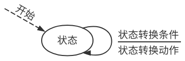

假设：仅考虑单向数据流动，但**控制信息双向流动**。

###### RDT 1.0 可靠信道上的可靠数据传输

假设：底层信道完全可靠，即不会发生错误，不会丢弃分组。

- 发送方协议：

  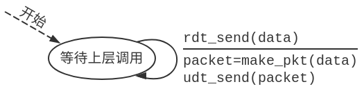

- 接收方协议：

  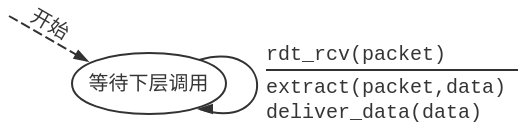

###### RDT 2.0 只可能产生位错误信道上的可靠数据传输

假设：底层信道只可能产生位错误，不会丢失，不会乱序。

错误检测机制：利用**校验和**检测**位错误**。

错误恢复机制：确认机制。接收方通过**ACK**显式告知发送方分组已正确接收，通过**NAK**显式告知发送方分组有误。发送方收到NAK后**重传分组**。

基于上述重传机制设计的RDT协议称为**ARQ**（Automatic Repeat reQuest）协议。

- 发送方协议：

  发送消息后需等待对方的控制消息，该类协议称为**停-等协议**。

  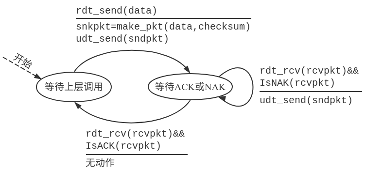

- 接收方协议：

  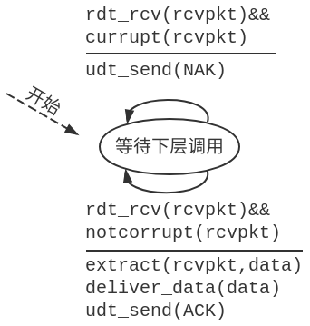

###### RDT 2.1 对控制消息错误的处理

错误检测机制：为控制消息增加校验和，**检错**并**纠错**。

错误恢复机制：为分组增加**序列号**以避免分组重复。当控制消息损坏时，发送方**重传分组**，接收方**丢弃重复分组**。

- 发送方协议：

  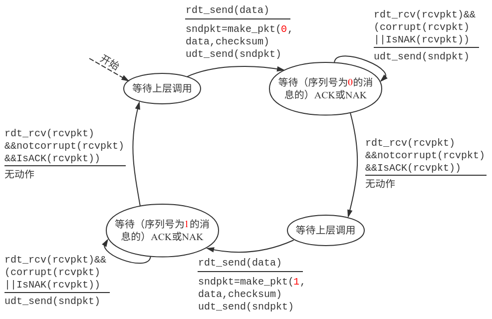

- 接收方协议：

  接收方**无法得知**控制消息是否被发送方正确收到。

  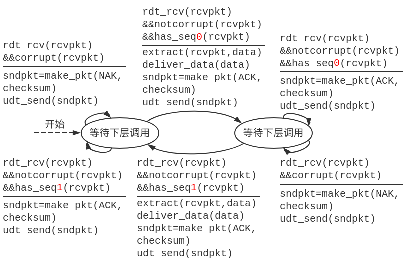

###### RDT 2.2 简化控制消息

错误恢复机制：接收方通过ACK告知发送方**最后一个被正确接收的分组**，即在ACK消息中显式地加入该分组**序列号**。发送方收到重复ACK时**重传分组**。

- 发送方协议：

  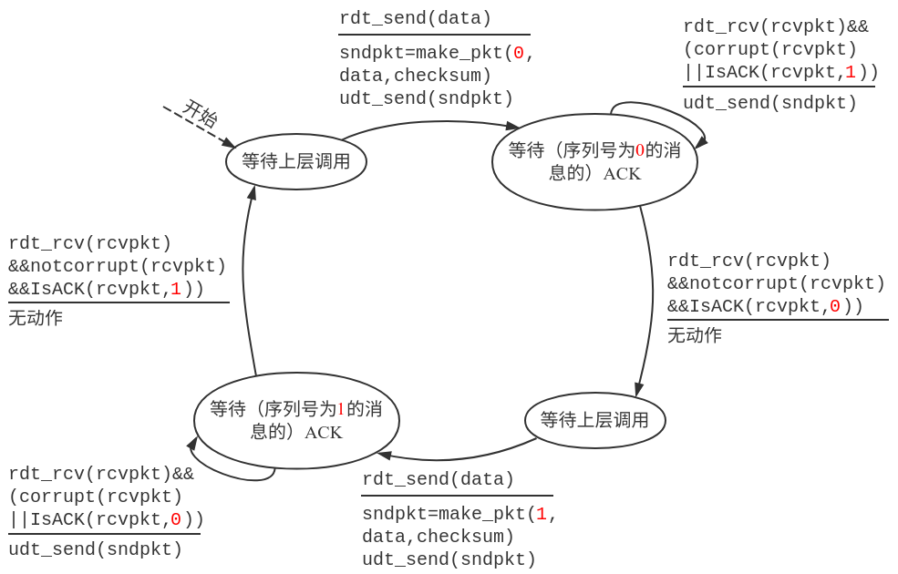

- 接收方协议：

  

###### RDT 3.0 可能发生位错误和分组丢失的信道上的可靠数据传输

假设：底层信道可能产生位错误及分组丢失。

错误恢复机制：发送方**等待合理时间**后若未收到ACK，则**重传分组**。为实现此机制，需要**定时器**。

- 发送方协议：

  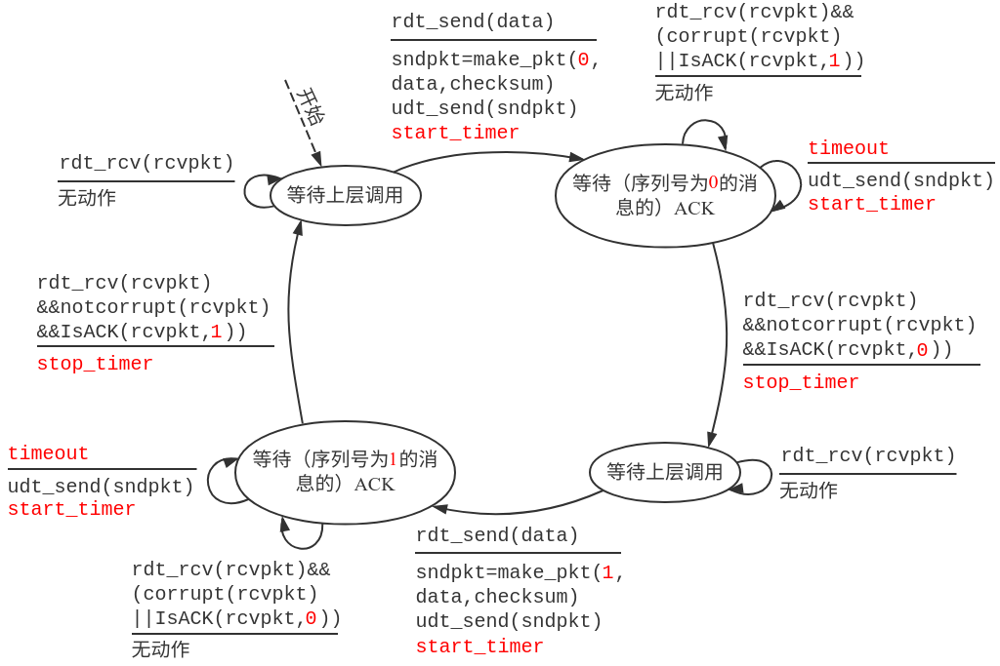

- 接收方协议：

  与RDT 2.2相同。

- 通信过程示例：

  - 无丢失、无延迟：

    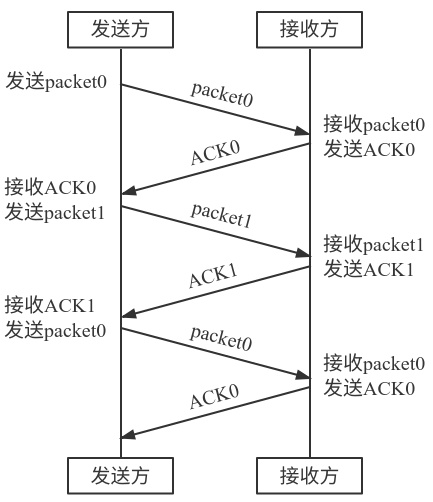

  - 丢失数据：

    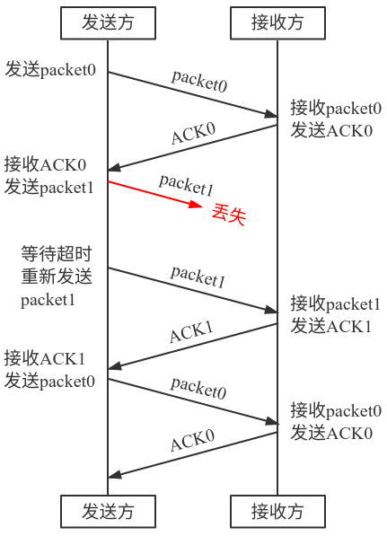

  - 丢失确认消息：

    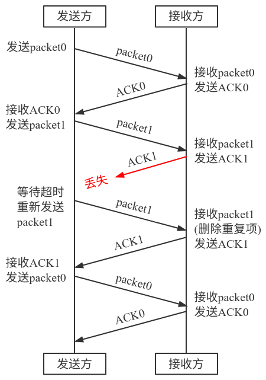

  - 确认消息延迟：

    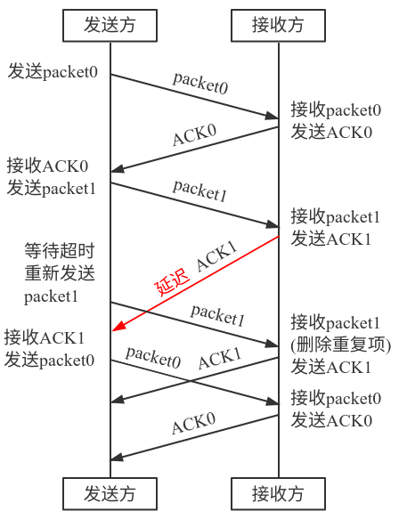

- 劣势：**性能很差**。由于**传播延迟**的存在，协议在高带宽链路上大部分时间在等待确认消息到达。

#### 流水线机制与滑动窗口协议

流水线机制要求更大的**序列号范围**以及更大的**分组缓存空间**。

**窗口**：发送/接收过程中**允许使用的序列号范围**。当窗口尺寸为N时，最多仅能有N个等待确认的消息。

##### GBN（Go Back N）协议

**累积确认**机制：发送方收到序列号为n的ACK消息时，表示**序列号为n的及其之前的所有分组**均已被正确接收。

- 发送方协议内容
  - 初始化：

    ```c
    base = 1; // 窗口左端
    nextseqnum = 1; // 准备发送的下一个序列号
    ```

  - `rdt_send(data)`：

    ```c
    if(nextseqnum < base + N) { // 窗口中仍有序列号可用，可以继续发送分组
        sndpkt[nextseqnum] = make_pkt(nextseqnum, data, chksum);
        udt_send(sndpkt[nextseqnum]);
        if(base == nextseqnum)
            start_timer(); // 若为第一个分组，则启动计时器
        nextseqnum++;
    } else
        refuse_data(data); // 窗口已满，无可用序列号，拒绝发送数据
    ```

  - 等待超时：

    ```c
    start_timer();
    for(int i = base; i < nextseqnum; i++)
        udt_send(sndpkt[i]); // 重新发送全部未确认分组
    ```

  - `rdt_rcv(rcvpkt) && notcorrupt(rcvpkt)`：

    ```c
    base = getacknum(rcvpkt) + 1; // 累积确认，滑动窗口
    if(base == nextseqnum)
        stop_timer(); // 所有已发送分组均已确认，停止计时器
    else
        start_timer(); // 重启计时器
    ```

  - `rdt_rcv(rcvpkt) && corrupt(rcvpkt)`：

    ```c
    // 无动作
    ```

- 接收方协议内容
  - 初始化：

    ```c
    expectedseqnum = 1;
    sndpkt = make_pkt(expectedseqnum, ACK, chksum);
    ```

  - `rdt_rcv(rcvpkt) && notcorrupt(rcvpkt) && hasseqnum(rcvpkt, expectedseqnum)`：

    ```c
    extract(rcvpkt, data);
    deliver_data(data);
    sndpkt = make_pkt(expectedseqnum, ACK, chksum);
    udt_send(sndpkt);
    expectedseqnum++;
    ```

  - 其余事件：

    ```c
    udt_send(sndpkt); // 当收到乱序到达的分组时，该处理逻辑将重新发送之前的expectedseqnum，即丢弃了乱序到达的分组
    ```

- 通信过程示例：

  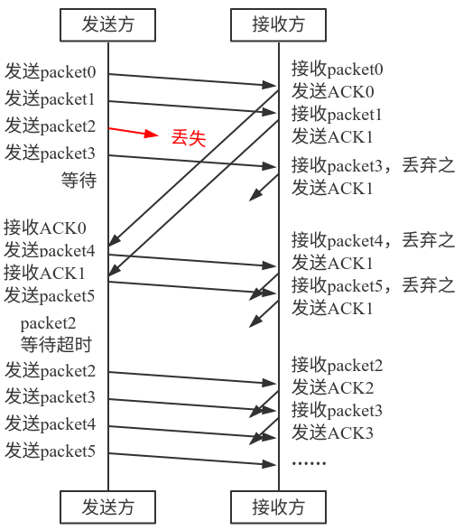

##### SR（Selective Repeat）协议

**单独确认**，**缓存**乱序到达的分组，仅重传没有确认的分组。

- 发送方协议内容

  - 初始化：

    ```c
    base = 1;
    nextseqnum = 1;
    ```

  - `rdt_send(data)`：

    ```c
    if(nextseqnum < base + N) { // 窗口中仍有序列号可用，可以继续发送分组
        sndpkt[nextseqnum] = make_pkt(nextseqnum, data, chksum);
        udt_send(sndpkt[nextseqnum]);
        start_timer(nextseqnum); // 为该分组启动单独的计时器
        nextseqnum++;
    } else
        refuse_data(data); // 窗口已满，无可用序列号，拒绝发送数据
    ```

  - 分组n等待超时：

    ```c
    udt_send(sndpkt[n]);
    start_timer(n);
    ```

  - `rdt_rcv(rcvpkt) && notcorrupt(rcvpkt)`：

    ```c
    n = getacknum(rcvpkt);
    isrcved[n] = 1; // 标记为已接收
    if(n == base) {
        while(isrcved[base]) { // 滑动窗口
            isrcved[base] = 0;
            base++;
        }
    }
    ```

  - `rdt_rcv(rcvpkt) && corrupt(rcvpkt)`：

    ```c
    // 无动作
    ```

- 接收方协议内容

  - 初始化：

    ```c
    base = 1;
    ```

  - `rdt_rcv(rcvpkt) && notcorrupt(rcvpkt)`：

    ```c
    n = getseqnum(rcvpkt);
    if(n >= base && n < base + N) { // 期望收到的分组
        sndpkt = make_pkt(n, ACK, chksum);
    	udt_send(sndpkt); // 发送ACK
        if(n != base) { // 乱序到达的分组
            rcvbuf[n] = rcvpkt; // 缓存分组
            isbufed[n] = 1;
        } else { // 按序到达的分组
            while(isbufed[base]) { // 滑动窗口
        		extract(rcvbuf[base], data);
    			deliver_data(data);
                isbufed[base] = 0;
    			base++;
            }
        }
    } else if(n >= base - N && n < base) { // 收到旧分组，表明发送方未收到之前的ACK
        sndpkt = make_pkt(n, ACK, chksum);
    	udt_send(sndpkt); // 发送ACK
    }
    // 忽略其余情况
    ```

  - 其余事件：

    ```c
    // 无动作
    ```

- 注意事项

  - 接收方窗口与发送方窗口**不同步**，彼此不需知道对方窗口状态。
  - 发送方与接收方**窗口大小之和**不应超过**序列号空间大小**。

- 通信过程示例：

  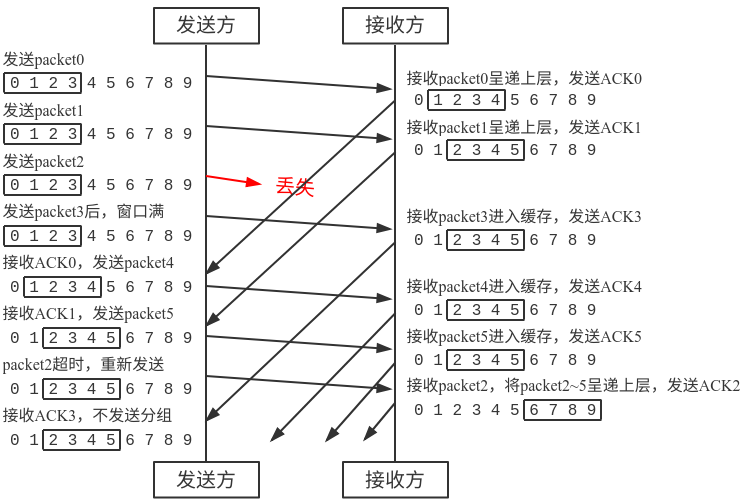

### TCP（Transmission Control Protocol）

TCP是一种**点对点**的，提供**全双工**的**可靠**且**有序**的**字节流**传输服务的传输协议。

TCP采用**流水线机制**传输信息，采用**拥塞控制**和**流量控制机制**动态调整窗口尺寸，在**发送方与接收方**均有缓存。

TCP是面向连接的，通信双方在通信前必须**建立连接**，连接状态只在**连接的两端**维护。TCP连接包括**缓存**、**连接状态变量**、**socket**等。

TCP没有规定乱序分组如何处理，其实现**由实现者确定**。

#### TCP可靠数据传输

##### 测量RTT

TCP使用**单一**重传定时器，为设置适当的超时时间，需要测量RTT。

- 估计RTT：多次测量从发送段到接收ACK的时间SampleRTT并计算**指数加权移动平均**，即EstimatedRTT=(1-α)EstimatedRTT+αSampleRTT。
- 估计安全边界：对SampleRTT与EstimatedRTT之差（绝对值）计算**指数加权移动平均**，即DevRTT=(1-β)DevRTT+β|SampleRTT-EstimatedRTT|。

- 设置超时时间：超时时间设定为EstimatedRTT+4DevRTT。

##### 协议内容

- 发送方协议

  - 从应用层收到数据：

    创建Segment（其中序列号为该Segment中**第一个字节的编号**），开启定时器，设置超时时间。

  - 超时：

    重传**引起超时的Segment**，重启定时器。

  - 收到ACK：

    遵循**累积确认**机制滑动窗口（其中ACK号表示期望收到的**下一个字节**的序列号），若窗口中仍有未确认分组则重启定时器。

  - 通信示例：

    - 丢失ACK：

      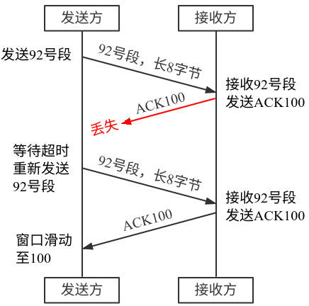

    - 确认超时：

      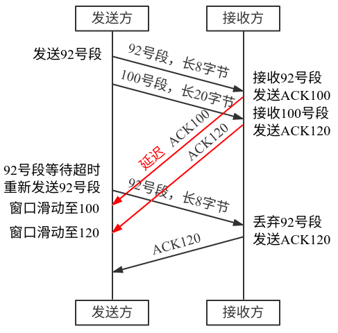

    - 累积确认：

      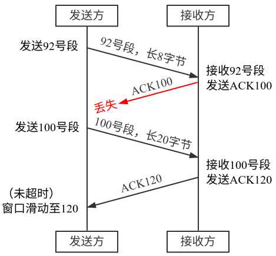

- 接收方协议

  - 段按序到达：

    等待500ms，若无下一段到达，则发送ACK。

  - 两段按序到达（接上种事件）：

    立即发送第二段的ACK。

  - 段乱序到达（制造gap）：

    立即发送**重复ACK**，即最后一个按序到达段的ACK。

  - 段乱序到达（填补gap）：

    若到达段位于gap最前端，则立即发送ACK。

##### 快速重传机制

- 原因：TCP若发生超时，超时时间将被重新设置（加倍），导致其很大。
- 内容：发送方**连续发送**多个分组，若收到**同一段的3个重复ACK**（即共收到同一段的4个ACK），则假定该段之后的段已经丢失，进行**快速重传**。
- **快速重传**：在定时器**超时之前**即重传。

#### TCP流量控制

- 原因：接收方处理TCP buffer中数据速度可能较慢，发送方**发送速度过快**可能淹没接收方（**buffer溢出**）。
- 内容：（假定接收方丢弃乱序到达段）
  - 估计可用空间：RcvWindow=RcvBuffer-(LastByteRead-LastByteRead)
  - 控制流量：接收方将RcvWindow写入段头部，发送方限制**已发送但未确认**的数据长度不超过RcvWindow尺寸。
  - 特殊处理：当RcvWindow=0时，发送方仍可以发送很小的段，以便接收方在应答中更新RcvWindow。

#### TCP连接管理

- 建立连接

  - 连接由客户端发起，服务端等待连接请求并接受。发送方与接收方建立连接后才能通信。

  - 随机选择**序列号**，分配**缓存**，交换**流量控制信息**。

  - **三次握手**：

    1. 客户端向服务端发送**SYN段**（不携带任何数据，SYN标志位置1），告知自身**初始序列号**。
    2. 服务端（若同意建立连接）**分配缓存**，向客户端发送**SYNACK段**（SYN标志位置1，ACK号为客户端初始序列号+1），告知自身**初始序列号**。
    3. 客户端向服务端发送**ACK段**（SYN标志位置0，ACK号为服务端初始序列号+1），该段**可能包含数据**。

    注意事项：若客户端第三次握手失败，服务端将**保留资源一段时间**，确认连接无法建立后才释放。

- 关闭连接

  - 客户端与服务端均能发起连接关闭请求，多数情况下为客户端发起。
  - **四次握手**：
    1. 客户端向服务端发送**FIN控制段**（FIN标志位置1）。
    2. 服务端收到FIN段后，回复**ACK段**。之后服务端应用尝试关闭连接，发送**FIN段**。
    3. 客户端收到FIN段后，回复**ACK段**并进入等待状态（一般等待30秒），若重复收到FIN段，则**重新发送ACK段**。
    4. 服务端收到ACK段后，**关闭连接**。

- 生命周期

  - 客户端

    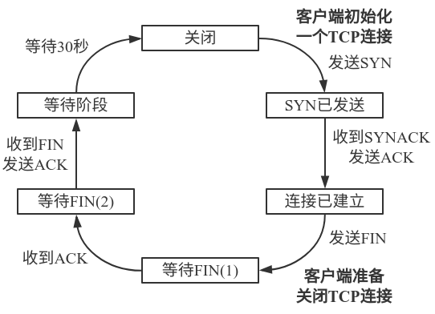

  - 服务端

    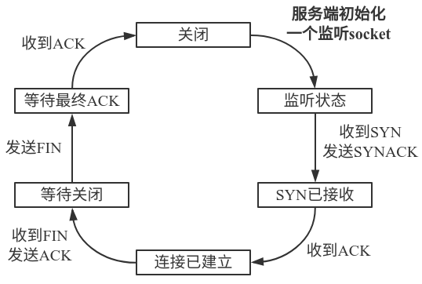

#### 拥塞控制

##### 拥塞

- 表现：**分组丢失**（缓存溢出）、**分组延迟过大**（排队）。
- 代价：要做更多的工作（重传），造成**资源浪费**；分组被丢失时，该分组**上游**的传输能力全部被浪费。

##### 控制方式

- 端到端拥塞控制：**端系统**通过观测**loss**，**delay**等网络行为判断是否发生拥塞。（网络层**不需要**显式提供支持）

  案例：TCP拥塞控制

  - 拥塞窗口（CongWin）：限制**已发送但未确认**的数据量。拥塞窗口大小可根据网络拥塞状况动态调整。

  - 速度限制：**拥塞窗口/RTT**。

  - 网络拥塞感知（**loss事件**）：**超时**或**3个重复ACK**。

  - **加性增-乘性减**（**AIMD**）

    - 无loss时，**线性**增加发送速率，直到发生loss。每个RTT将拥塞窗口增大一个MSS（最大段长度）。

      该思想称为**拥塞避免**(**CA**)。

    - 每次发生loss将拥塞窗口**减半**。

  - **慢启动**（**SS**）

    可用带宽可能远远高于初始速率，希望初始速率快速增长。

    - 设初始速率为1MSS，当连接开始时，速率**指数增长**，即每个RTT（**收到ACK时**）将拥塞窗口大小**翻倍**。

  - **Threshold**变量：**loss发生前**拥塞窗口大小的**一半**。

    当拥塞窗口大小小于Threshold时进行指数增长（该阶段增长**不可超过Threshold**），达到Threshold后进行线性增长。

  - loss事件处理

    TCP Tahoe：返回SS状态。

    TCP Reno：

    - 3个重复ACK：拥塞窗口**减半**（减至新的Threshold），之后线性增长。
    - 超时：拥塞窗口直接减为**1MSS**，之后按前述规则指数/线性增长。

- 网络辅助的拥塞控制：**路由器**向发送方显式地反馈网络拥塞信息。

  案例：ATM网络ABR拥塞控制

  - 若发送方路径空闲，则尽量使用**可用带宽**；若发送方路径拥塞，则将发送速率降到**最低保障速率**。

  - RM（资源管理）cell：由发送方发送，途中交换机设置RM cell位（NI位表示rate不得增长，CI位表示拥塞），最终cell由接收方返回给发送方。

    RM cell中有显式的速率字段，拥塞的交换机可将其指定为更小的值。

  - 数据cell中有EFCI位，若其被置为1，则发送方在返回的RM cell中置CI位。

#### TCP性能

- 吞吐率：

  忽略慢启动，设超时时CongWin=W，则超时后CongWin=W/2。**TCP的平均吞吐率为0.75W/RTT**。

  设丢包率为L，且W趋于无穷大，则从W/2至W共发送分组3W^2/8，故L=8/(3W^2)，即L极小，不现实。因此在**高速网络下应设计新的TCP**。

- 公平性：

  设K个TCP会话共享瓶颈带宽R，则**每个会话的平均速率为R/K**。

  **TCP具有公平性**，即在不公平条件下，会话间的AIMD机制将使会话间的带宽分配向平均分配收敛。

  **TCP对UDP不公平**，这是由于TCP有拥塞控制机制，而UDP以恒定速率发送。

  **并发TCP连接产生不公平**，开启更多并发TCP连接的应用可获得更大的速率。

### 例题

#### 题目

> 两台主机在1Gbps的链路上通信，端到端传播延迟为15ms，分组大小为1KB。求在RDT 3.0协议下的发送方利用率（即发送方发送一个分组的时间占发送方开始发送两个分组间的间隔时间的比例）。

#### 题解

设端到端传播延迟为RTT。

发送一个分组的时间T=L/R=1KB/1Gbps=8ms。

故发送方利用率U=T/(T+RTT)=0.00027。

#### 题目

> 数据链路层采用后退N帧（GBN）协议，发送方已经发送了编号为0~7的帧。当计时器超时时，若发送方只收到0、2、3号帧的确认，则发送方需要重发的帧数是多少？分别是哪几个帧？

#### 题解

GBN协议的确认方式为累积确认，由于已收到最大确认号为3，则仅需重发4个帧，分别为4、5、6、7号帧。

#### 题目

> 一个TCP连接总是以1KB的最大段长发送TCP段，发送方有足够多的数据要发送。当拥塞窗口为16KB时发生了超时，如果接下来的4个RTT时间内的TCP段传输都是成功的，那么当第4个RTT时间内发送的所有TCP段都得到肯定应答时，拥塞窗口大小是多少？

#### 题解

Threshold=16/2=8KB

超时触发慢启动，CongWin=1KB

之后3个RTT中CongWin依次为2KB，4KB，8KB，慢启动结束。

最后一个RTT后CongWin变为9KB。

## 第5-7周 网络层

**每个主机和路由器**都运行网络层协议，路由器检验所有穿过它的IP数据包头部域，并决定如何处理IP数据报。

网络层不是端到端层，而是**点到点**层，其上服务是主机到主机的，由**网络核心**实现。

核心功能：

- **转发**：通过**转发表（路由表）**将分组从路由器**输入端口**转移到合适的**输出端口**。
- **路由**：通过**路由算法（协议）**确定分组从源到目的地经过的**端到端**路径。
- **建立连接**（并非所有网络都需要）：由路径上的路由器等网络设备参与建立两端**主机**间的**逻辑连接**。

### 服务模型

- **无连接服务**：每个分组**独立**确定传输路径。例如**数据报网络**：

  - 每个分组携带**目的地址**，路由器基于路由算法（协议）**构建转发表**，根据目的地址**检索转发表**转发分组。

  - Internet中，由于地址空间过大，路由器转发表的键经常不是具体地址而是**地址范围**，此时检索策略为**最长前缀匹配优先**。
  - 常见数据报网络：Internet。

- **连接服务**：首先确定路径（**建立连接**）后，一系列分组**沿该路径传输**，最后**拆除连接**。例如**虚电路网络**：

  **虚电路**（VC）：从源主机到目的主机，类似于电路的**逻辑连接**。其与电路最主要的区别是虚电路进行**分组交换**，分组的传输利用链路的**全部带宽**。

  **虚电路信令协议**：用于虚电路的建立、维护与拆除。

  - 为标识虚电路，为每**段**虚电路生成**虚电路标识**（VCID），一条虚电路可能有多个编号。分组携带**虚电路标识**（而不是目的主机地址），路由器转发分组时根据**转发表**修改虚电路号。转发表中**多个虚电路可能通过同一接口**。

  - 虚电路经过的**每个网络设备**（如路由器）维护**每条经过它的虚电路**的连接状态，网络设备资源可以面向虚电路进行**预分配**（即可预期的服务性能）。

  - 通信过程：**呼叫建立**，**数据传输**，**拆除呼叫**。
  - 常见虚电路网络：ATM。

**数据报网络**与**虚电路网络**都是**分组交换网络**。

### IPv4协议

#### IP数据报（IP分组）

结构：首部+数据（例如TCP段或UDP段），其中首部可分为固定部分（20字节）与可变部分（长度最短为0）。

头部信息：

| 字段名                          | 长度   | 说明                                                         |
| ------------------------------- | ------ | ------------------------------------------------------------ |
| 版本号                          | 4位    | 4表示IPv4，6表示IPv6。                                       |
| 首部长度                        | 4位    | 以4字节为单位，如其值为5时表示20字节。                       |
| 服务类型（TOS）（又名区分服务） | 8位    | 仅当网络提供区分服务时使用，一般不使用，值为0x00。           |
| 总长度                          | 16位   | 整个IP数据报的长度，以字节为单位。可推得IP分组可封装的最大数据量为65515字节。 |
| 标识                            | 16位   | 标识一个IP分组，每产生一个IP分组计数器加1。                  |
| 标志位                          | 3位    | 3位分别为保留位、DF（禁止分片）位、MF（更多片）位。详见下节。 |
| 片偏移                          | 13位   | 该分片在原IP分组中的相对偏移量（以8字节为单位）。若未分片则为0。 |
| 生存时间（TTL）（又名存活时间） | 8位    | 分组在网络中可以通过的路由器数，每通过一个路由器减1。TTL=0时路由器将丢弃该分组（同时向源主机发送ICMP报文）。 |
| 协议                            | 8位    | 指示分组封装的数据包所属协议，实现了IP协议的复用/分用。如值为6时表示TCP，17表示UDP。 |
| 首部校验和                      | 16位   | 对首部的差错编码，计算算法同UDP。逐跳计算，逐跳校验。        |
| 源/目的IP地址                   | 各32位 | 标识源主机/路由器与目的主机/路由器的IP地址。                 |
| 选项                            | 1~40B  | 可记录源选路径、时间戳、路由记录等，很少使用。               |
| 填充                            | 0~3B   | 补齐首部，符合32位对齐。即保证首部长度为4字节倍数。          |

#### IP分片

**最大传输单元**（MTU）：**链路层数据帧**可封装的**数据量上限**。

- 过程：设原IP分组总长度为L，待转发链路MTU为M。

  - 当L>M时，

    - 当DF=0时，该分组被分片。

      每个分片的标识**与原IP分组的标识相同**，片偏移从0开始递增取值。

      除最后一片外，其它分片通常均分为**MTU允许的最大分片**，MF标志位置0。最后一片MF标志位置1。

    - 当DF=1时，该分组被丢弃。

  - 当L≤M时，分组不被分片。

- 当较大IP分组向较小MTU的链路转发时，**若IP分组允许被分片**（DF标志位为1），**路由器**可将其**分片**为多个IP分组（其中最后一片MF标志位为0，其余片标志位为1），到达**目的主机**后重组。
- 注意事项：由于片偏移的计数单位（8字节），一个分组的分片中，**除最后一片外**，其余分片大小必为**8字节的倍数**。

#### IP编址与IP子网

**接口**：主机/路由器与物理链路的连接。路由器通常有多个接口，主机通常仅有1或2个接口。

编址要求：为**实现网络层功能的接口**编址。

**IP地址**：与每个**接口**（而不是主机/路由器）关联。长度32位，高位称为**网络号**，低位称为**主机号**。常写作**点分十进制**形式。

**IP子网**：具有**相同网络号**的**接口**。同一子网内接口**不跨越路由器**（或网络层以上设备）即可彼此**物理联通**。

##### 有类编址

| 地址类别 | 高位模式 | 网络号长度           | 地址范围                  |
| -------- | -------- | -------------------- | ------------------------- |
| A类地址  | 0        | 8位                  | 0.0.0.0~127.255.255.255   |
| B类地址  | 10       | 16位                 | 128.0.0.0~191.255.255.255 |
| C类地址  | 110      | 24位                 | 192.0.0.0~223.255.255.255 |
| D类地址  | 1110     | 不区分网络号与主机号 | 224.0.0.0~239.255.255.255 |
| E类地址  | 1111     | 不区分网络号与主机号 | 240.0.0.0~255.255.255.255 |

D类地址用于标识互联网中的**一组主机**，仅能用作**目的地址**，又称为**多播地址**或**组播地址**。

E类地址保留作为**研究使用**。

##### 特殊IP地址

特殊IP地址**不可分配**给主机或路由器使用。

| 网络号 | 主机号       | 作为源地址 | 作为目的地址 | 用途                                         |
| ------ | ------------ | ---------- | ------------ | -------------------------------------------- |
| 全0    | 全0          | 可以       | 不可以       | 本网范围内表示本机；路由表中表示默认路由     |
| 全0    | 特定值       | 不可以     | 可以         | 本网内某特定主机                             |
| 全1    | 全1          | 不可以     | 可以         | **受限广播地址**，对本网广播（路由器不转发） |
| 特定值 | 全0          | 不可以     | 不可以       | **网络地址**，表示一个网络                   |
| 特定值 | 全1          | 不可以     | 可以         | **直接广播地址**，对特定网络上所有主机广播   |
| 127    | 非全0且非全1 | 可以       | 可以         | **环回地址**，用于本地软件环回测试           |

##### 私有IP地址

私有IP地址仅能在企业或组织**内部使用**，公共互联网将认为上述IP地址**非法**。

| 网络类型 | 网络号                 | 地址块数 |
| -------- | ---------------------- | -------- |
| A        | 10                     | 1        |
| B        | 172.16至172.31         | 16       |
| C        | 192.168.0至192.168.255 | 256      |

##### 子网划分

- **子网号**：主机号的高位，用于区分子网。	

- **子网掩码**：形式同IP地址，其中**网络号与子网号部分置1**，**主机号部分置0**。

  例如A类网络默认子网掩码为255.0.0.0；使用3位子网号的B类网络的子网掩码为255.255.224.0。

  将目的IP地址与子网掩码**按位与**可得目的子网地址。

### 无类域间路由（CIDR）与路由聚集

不以A类、B类、C类划分地址，网络号+子网号（又称**网络前缀**）可以为**任意长度**。

**无类地址**：格式为a.b.c.d/x，其中x为**网络前缀**的长度。例如201.2.3.64（子网掩码255.255.255.192）可表示为201.2.3.64/26。

**路由聚集**：将**路径相同**，**可用较大子网表示**的多个子网，在路由表中将其聚合为一个子网。

#### CIDR优势

- 提高IPv4地址空间**分配效率**。
- 提高**路由效率**，可将多个子网聚合为一个较大的子网（超网），从而提供**路由聚集**功能。
- 层级编址使**路由信息通告**更高效（下层仅需向上层告知自身负责的子网地址）。

### 动态主机配置协议（DHCP）

主机获取IP地址的方式：**硬编码**（静态配置）或**动态获取**（使用DHCP）。

DHCP获取内容：**IP地址**、**子网掩码**、**默认网关**、**DNS服务器名称与IP地址**。

#### 优势

- 即插即用。
- 允许**地址重用**。
- 支持**移动用户加入网络**。

#### 协议内容

DHCP服务器知名端口67，客户端知名端口68，协议在**应用层**通过**UDP**实现。

1. 主机**广播**发现报文“DHCP discover”（源IP为0.0.0.0，目的IP为255.255.255.255）。
2. DHCP服务器**广播**提供报文“DHCP offer”，并**附上拟提供的IP地址**（源IP为自身IP，目的IP为255.255.255.255）。
3. 主机**广播**请求报文“DHCP request”请求IP地址，并**附上准备使用的IP地址**（源IP为0.0.0.0，目的IP为255.255.255.255）。
4. DHCP服务器**广播**确认报文“DHCP ack”分配IP地址，并**附上确认提供的IP地址**以及**子网掩码**、**默认网关**、**DNS服务器**等（源IP为自身IP，目的IP为255.255.255.255）。

### 网络地址转换（NAT）

#### 动机

- IPv4地址耗尽，只能从ISP申请一个IP地址。
- 本地网络设备IP变更无需告知外界网络。
- 变更ISP时无需修改内网设备IP。
- 内网设备对外网不可见，不可直接寻址，更加安全。

#### 实现

**NAT转换表**：记录**WAN端地址**（NAT IP地址及端口号）与**LAN端地址**（源IP地址及端口号）的映射。

- 使用**(NAT IP地址, 新端口号)**替换每个外出IP数据报的**(源IP地址, 源端口号)**并记录至**NAT转换表**。
- 根据**NAT转换表**使用**(源IP地址, 源端口号)**替换每个进入内网IP数据报的**(目的IP地址, 目的端口号)**。

由于端口号字段长度16位，故（理论上）可支持2^16=65536个并行连接。

**P2P应用等特殊应用必须考虑到NAT的存在**。

#### NAT穿透

解决方案：

- **静态配置NAT**：将特定端口的连接请求转发给特定服务器。
- **UPnP互联网网关设备协议**（自动配置）：内部服务器自动获取NAT公共IP地址，并向NAT转换表中增删端口映射。
- **中继**：设置公网中的中继服务器，NAT内部主机与外部客户分别与中继服务器建立连接，由中继服务器桥接两个连接的分组。

### 互联网控制报文协议（ICMP）

功能：**差错（异常）报告**、**网络探询**。

#### 报文类型

- 差错报告报文
  - 目的不可达：IP数据报已经到达目的主机但无法成功交付，从而被丢弃。
  - 源抑制：通知发送主机降低发送数据报的速度。
  - 超时/超期：典型例子为TTL超时，路由器丢弃TTL=0的数据报时向源主机发送该报文。
  - 参数错误：数据报头部有错误。
  - 重定向：数据报应到达的网络不应由该路由器转发。
- 网络探询报文
  - 回声请求/应答：探测网络是否可达。例如ping。
  - 时间戳请求/应答：请求时间戳。

#### 报文格式

| 字段名 | 长度 | 说明                                                         |
| ------ | ---- | ------------------------------------------------------------ |
| 类型   | 8位  | 说明报文类型。                                               |
| 编码   | 8位  | 说明报文含义。                                               |
| 检验和 | 16位 | 用于差错校验。                                               |
| （略） | 32位 | 取决于类型。                                                 |
| 数据   | 可变 | 报文内容，例如差错报告中应封装出错数据报的头部及前8字节数据。 |

#### 不发送ICMP报文的情况

- 对ICMP差错报告报文不发送ICMP差错报告报文。
- 对分片数据报，仅对第1个分片发送ICMP差错报文。
- 对多播/组播数据报不发送ICMP差错报文。
- 对具有特殊地址（127.0.0.0或0.0.0.0）的数据报不发送ICMP差错报文。
- 不再使用的ICMP报文，例如信息请求/应答、子网掩码请求/应答、路由器询问/通告等。

#### 示例

Traceroute：用于跟踪数据报路径。

1. 源主机向目的主机发送一系列UDP数据报，其中第i组数据报TTL=i，且目的端口号为不可能使用的端口号。
2. 第i个路由器将第i个数据报丢弃，并向源主机发送ICMP报文（携带路由器名称和IP地址）。
3. ICMP报文到达源主机时，记录路由器信息及其RTT。
4. 目的主机对于接收到的数据报返回“目的端口不可达”ICMP报文，此时traceroute探测结束。

### IPv6

动机：IPv4地址空间分配殆尽；改进首部格式（快速处理/转发数据报、支持QoS）。

#### 地址格式

- 以**冒号**分隔的8个4位16进制数，如1080:0:FF:0:8:800:200C:417A。
- 若地址中存在连续多个0，则可使用**双冒号**压缩，如FF01:0:0:0:0:0:0:43可写作FF01::43，每个IPv6地址中至多仅能包含一个双冒号（多个双冒号将**存在歧义**）。
- IPv4嵌入形式：地址前缀为0:0:0:0:0:FFFF时，最后32位表示一个IPv4地址，可使用点分十进制表示，如::FFFF:13.1.68.3。
- 使用地址前缀（类似CIDR格式）划分子网，如2002:43c:476b::/48。
- URL中使用中括号括起IPv6地址，以避免地址与端口号发生歧义，如http://[3FFE::1:800:200C:417A]:8000。

#### 地址类型

- **单播（unicast）地址**：用于**一对一**通信，可作为源地址或目的地址。
- **多播（multicast）地址**：用于**一对多**通信，仅可作为目的地址。
- **任意播（anycast）地址**：用于**一对一组之一**，即将数据报送至一组主机中任意一个（通常为最近的一个），仅可作为目的地址。
- 广播地址被定义为特殊的多播地址。

#### 报文格式

固定长度（40字节）的首部，**不允许路由器分片**（源主机可以对数据报进行分片）。

| 字段       | 长度  | 说明                                                     |
| ---------- | ----- | -------------------------------------------------------- |
| 版本       | 4位   | 说明版本为IPv4或IPv6。                                   |
| 优先级     | 8位   | 标识数据报的优先级。                                     |
| 流标签     | 20位  | 标识一系列的数据报流。                                   |
| 载荷长度   | 16位  | 载荷总长，包括扩展首部及数据。理论最大长度为65535。      |
| 下一个首部 | 8位   | 指向下一个扩展首部（若存在）或直接指向传输层协议的首部。 |
| 跳步限制   | 8位   | 对应IPv4中的TTL。                                        |
| 源地址     | 128位 | 源主机地址。                                             |
| 目的地址   | 128位 | 目的主机地址。                                           |
| 载荷       | 可变  | 包含扩展首部及数据。                                     |

#### 与IPv4区别

- 移除校验和，减少每跳处理时间。
- 允许选项字段，但移至扩展首部中，可存在多个选项首部。
- ICMPv6：增加报文类型（如“报文过大”）；增加多播组管理。

#### 过渡问题

**隧道**：IPv6数据报作为**IPv4数据报的载荷**进行封装，以穿越IPv4网络。

### 路由算法

#### 网络抽象

- 路由器被抽象为图中的节点。
- 链路被抽象为图中的边。
- 根据网络抽象的目的及需要，将链路的某些具体属性抽象为图中的边权，例如带宽倒数、拥塞程度等。通常边权越小，路径越好。

在上述抽象下，路由问题抽象为求解从源至目的的最小费用路径。

**路由算法**即**寻找最小费用路径**的算法。

#### 路由算法分类

##### 按配置方法分类

- 静态路由
  - 缺点：手工配置，路由更新慢，不能反映网络变化。
  - 优点：结合人类智慧。
- 动态路由：
  - 优点：路由更新快（通常定期更新），及时响应链路费用或网络拓扑变化。

##### 按所需信息范围分类（主要为动态路由分类）

- 基于全局信息（需要预先掌握完整的网络拓扑与链路费用信息）

  例如**链路状态（LS）路由算法**。

- 基于分散信息（路由器只掌握物理相连的邻居及链路费用信息）

  例如**距离向量（DV）路由算法**。

#### 链路状态路由算法

##### 算法描述

1. 每个路由器构造**链路状态分组**（包括邻居IP地址与链路费用）并使用**类泛洪**方式**广播**。
2. 路由器收集到全部链路状态后，**构造网络拓扑**。
3. 采用Dijkstra算法计算最短路径，k次迭代后可得到到达k个目的节点的最短路径。最终可获得一棵最短路径树。
4. 根据最短路径树求得转发表。

##### 存在问题

- **振荡现象**：路由器通过链路状态路由算法改变路由方向将影响链路费用，当网络中多个路由器同时改变路由方向至空闲链路时，原空闲链路可能变为拥挤，原拥挤链路可能变为空闲，从而导致路由再次执行路由算法后重新定向至该（原拥挤现空闲）链路。如此反复，可能导致数据报传输路径在不同链路间反复切换。若参与振荡的两条链路方向相反，数据报可能在链路中反复循环，直至TTL=0而丢失。

#### 距离向量路由算法

##### Bellman-Ford方程

d(x,y)=min{c(x,v)+d(v,y)}

其中d(x,y)表示x到y的最短路径费用，c(x,v)表示x到达邻居v的费用。

##### 算法思想

**距离向量**：当前节点到达其它节点的**最小费用估计**向量。

- 节点已知到达每个邻居的费用，维护其**所有邻居的距离向量**。
- 节点不定时地将自身的距离向量估计**发送给其邻居**。
- 节点接收到邻居的距离向量估计时，根据B-F方程**更新自身的距离向量估计**。
- 距离向量最终将**收敛于实际最小费用**。

##### 算法描述（对每个节点）

1. **等待**本地局部链路费用变化或收到邻居的距离向量更新。
2. **重新计算**距离向量估计。
3. 若距离向量改变，**通告所有邻居**。返回第1步。

##### 算法特点

- 异步迭代：在**局部链路费用改变**或有**来自邻居的距离向量更新**时进行局部迭代。
- 分布式：每个节点仅当**距离向量变化时**通告给邻居。

##### 存在问题

- **无穷计数现象**：当节点y去往x的链路费用增大时，y使用B-F方程，通过邻居z的距离向量重新估计自身的距离向量，但z距离向量中去往x的路径经过y，从而导致y更新后的距离向量并非真实距离。y更新后通告z，z更新距离向量后通告y，y又将更新距离向量，如此循环趋近于真实距离造成大量的更新。当链路中存在特殊环路时，更新次数将趋于无穷大。

  解决方案：

  - **毒性逆转**：若z去往x的路径经过y，则z向y通告更新时将去往x的距离设为无穷大。如此可避免循环依赖。

    毒性逆转**未必能够彻底解决**无穷计数问题。

  - **定义最大度量**：定义最大有效费用值，例如定义15跳步作为最大有效费用值，则16跳步表示∞。如此可限制更新次数。

#### 层次路由策略

动机：**网络规模过大**时，上述路由算法都将无法运行；网络管理期望**自治**。

##### 内容

* 聚合路由器为一个区域（**自治系统**，AS）并赋予编号。
* 同一自治系统内路由器运行相同路由协议（算法），称为**自治系统内部路由协议**。不同自治系统内路由器可以运行不同的路由协议。
* 自治系统设置**网关路由器**，连接其它自治系统网关路由器。网关路由器转发表由内部路由算法与系统间路由算法共同配置。

##### 系统间路由任务

- 学习**通过相邻网络可以到达的目标网络集合**。
- 将网络可达性信息传播给内部路由器（以便内部路由器向合适的网关路由器转发）。
  - **热土豆路由**：当有多个网关路由器均可到达目的网络时，将数据报转发给**最近的网关路由器**。

### Internet路由

**Internet采用层次路由**。

常见自治系统内部路由协议：路由信息协议（RIP）、开放最短路径优先（OSPF）、内部网关路由协议（IGRP）。

#### 路由信息协议（RIP）

- 采用**距离向量路由算法**。
  - 使用**跳步数**作为链路费用，同时定义最大有效跳步数为15跳步。
  - 邻居间每隔30秒交换距离向量，每次通告最多包含25个目的子网距离。
  - 交换的距离向量信息中**包含下一跳信息**，以实现**毒性逆转**。
- 若180秒未收到某邻居的通告，则认为该邻居/链路失效，重新计算路由并发送新通告。
- 在**应用层**实现，使用**UDP**发送通告报文。（该功能仍是为了完成网络层功能，因此路由器仍是网络层设备）

#### 开放最短路径优先（OSPF）

- 采用**链路状态路由算法**。
  - 通告中每个入口对应一个邻居。
  - 通告在**整个自治系统**内泛洪。
  - 通告报文直接封装至**IP数据报**中。
- 优点
  - OSPF报文**可被认证**（预防恶意攻击）。
  - 允许使用**多条相同费用的路径**（实现负载均衡）。
  - 针对**不同ToS**可设置**不同费用度量**。
  - 支持**单播路由与多播路由的集成**。
  - 支持**自治系统进一步分层**。
    - 在主干区与小区域交界处的路由器称作**区边界路由器**，负责汇总所在区网络的距离并通告其它区边界路由器。
    - 在主干区内运行OSPF路由算法的路由器称为**主干路由器**。
    - 在主干区边缘连接其它自治系统的路由器称为**AS边界路由器**。

#### 边界网关协议（BGP）

事实上的标准**域间路由协议**（自治系统间协议）。

- BGP路由器间交换BGP报文基于**半永久的TCP连接**，通过**BGP会话**进行，通告去往不同**目的前缀**的**路径**（路径向量协议）。
- 会话类型
  - eBGP：从**邻居系统**获取子网可达性信息。
  - iBGP：向**自治系统内部**传播子网可达性信息。
- 报文类型
  - OPEN：与peer**建立TCP连接**并**认证发送方**。
  - UPDATE：**通告新路径**或**撤销原路径**。
  - KEEPALIVE：无UPDATE时**保持连接活动**，也用于**确认OPEN请求**。
  - NOTIFICATION：报告先前报文的**差错**，也用于**关闭连接**。
- 通告内容
  - 子网前缀
  - BGP属性
    - AS-PATH（自治系统路径）：包含到达该前缀应**经过的AS序列**。
    - NEXT-HOP（下一跳）：指向**下一个自治系统**，即开始一个AS-PATH的**路由器接口**。
- **路由选择策略**
  - 网关路由器收到路由通告后利用**输入策略**决定是否接收该路由。BGP路由是**基于策略**的路由。
  - 当路由器获知到达同一目的系统的多条路由时，按顺序进行如下决策：
    1. 选择**本地偏好值较大**的路径。
    2. 选择**最短的AS-PATH**，即经过较少的自治系统。
    3. 选择**最近的下一跳**路由器（热土豆路由）。
    4. 附加准则。

#### 系统内与系统间为何采用不同路由协议

- 策略上：系统间希望能够控制流量如何被路由，而系统内部仅需单一管理。
- 规模上：层次路由节省路由表大小，减少更新流量，适应大规模互联网。
- 性能上：系统间由策略主导，系统内侧重性能。

### 例题

#### 题目

> 一个数据报（长度4000B，ID=x，标志位=0，片偏移=0）将要向MTU=1500B的输出链路发送，求分片数量、各分片大小、各分片ID、各分片MF、各分片的片偏移值。

#### 题解

最大分片可容纳数据量=floor((1500-20)/8)*8=1480(B)

分片数量=ceil((4000-20)/1480)=3(片)

故前2片大小为1500B，第3片大小为1040B。

各分片ID=x。

前2片MF=1，第3片MF=0。

第1片片偏移=0，第2片片偏移=185，第3片片偏移=370。

#### 题目

> 图中网络有多少个IP子网？
>
> 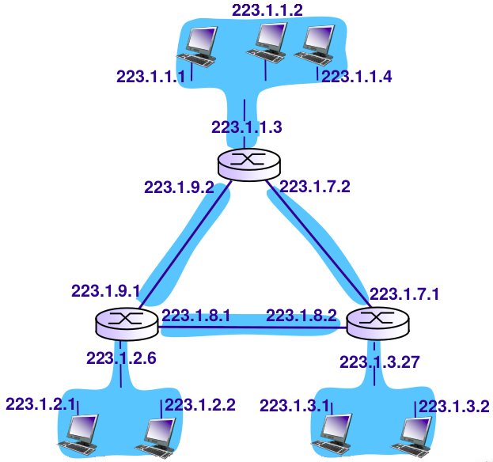

#### 题解

将网络层以上的设备从图中抹去（但不抹去接口），则其余接口及链路被分为6个区域，因此有6个子网。

#### 题目

> 将网络201.2.3.0（子网掩码255.255.255.0）划分为等长的4个子网。试写出子网掩码及4个子网的网络地址。

#### 题解

将原子网掩码最后8位的高2位设为1（用作子网号），得子网掩码为255.255.255.192。

4个子网分别为201.2.3.0，201.2.3.64，201.2.3.128，201.2.3.192。

#### 题目

> 某网络拓扑如下图所示，路由器R1通过接口E1、E2分别连接局域网1、局域网2，通过接口L0连接路由器R2，并通过路由器R2连接域名服务器与互联网。R1的L0接口的IP地址是202.118.2.1；R2的L0接口的IP地址是202.118.2.2，L1接口的IP地址是130.11.120.1，E0接口的IP地址是202.118.3.1；域名服务器的IP地址是202.118.3.2。
>
> R1和R2的路由表结构为：
>
> | 目的网络IP地址 | 子网掩码 | 下一跳IP地址 | 接口 |
> | -------------- | -------- | ------------ | ---- |
> |                |          |              |      |
>
> (1) 将IP地址空间202.118.1.0/24划分为2个子网，分别分配给局域网1、局域网2，每个局域网徐分配的IP地址数不少于120个。请给出子网划分结果，说明理由或给出必要的计算过程。
>
> (2) 请给出R1的路由表，使其明确包括到局域网1的路由、局域网2的路由、域名服务器的主机路由和互联网的路由。
>
> (3) 请采用路由聚合技术，给出R2到局域网1和局域网2的路由。
>
> 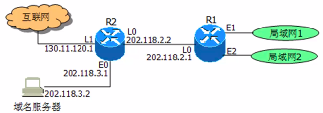

#### 题解

##### (1)

由于202.118.1.0/24是一个标准C网，地址空间大小为256，要分成各120个地址的子网，必须将原地址空间平分。

划分结果为：

| 子网地址      | 子网掩码        |
| ------------- | --------------- |
| 202.118.1.0   | 255.255.255.128 |
| 202.118.1.128 | 255.255.255.128 |

（也可写作CIDR形式，即202.118.1.0/25与202.118.1.128/25）

地址分配方案：上述子网1分配给局域网1，子网2分配给局域网2。

##### (2)

（以子网1分配给局域网1，子网2分配给局域网2作为前提进行讨论）

R1的路由表如下：

| 目的网络IP地址      | 子网掩码                            | 下一跳IP地址        | 接口 |
| ------------------- | ----------------------------------- | ------------------- | ---- |
| 202.118.1.0         | 255.255.255.128                     | -（直连网络故不填） | E1   |
| 202.118.1.128       | 255.255.255.128                     | -（直连网络故不填） | E2   |
| 202.118.3.2         | 255.255.255.255（主机看做特殊子网） | 202.118.2.2         | L0   |
| 0.0.0.0（缺省路由） | 0.0.0.0（缺省不匹配任何前缀）       | 202.118.2.2         | L0   |

##### (3)

聚合条件：

- 多个子网**地址连续**（或相对连续），可使用较大网络描述。
- 下一跳**接口相同**。

故R2到局域网1和局域网2的路由可以聚合。R2路由表中到局域网1和局域网2的路由表项如下：

| 目的网络IP地址 | 子网掩码      | 下一跳IP地址 | 接口 |
| -------------- | ------------- | ------------ | ---- |
| 202.118.1.0    | 255.255.255.0 | 202.118.2.1  | L0   |

